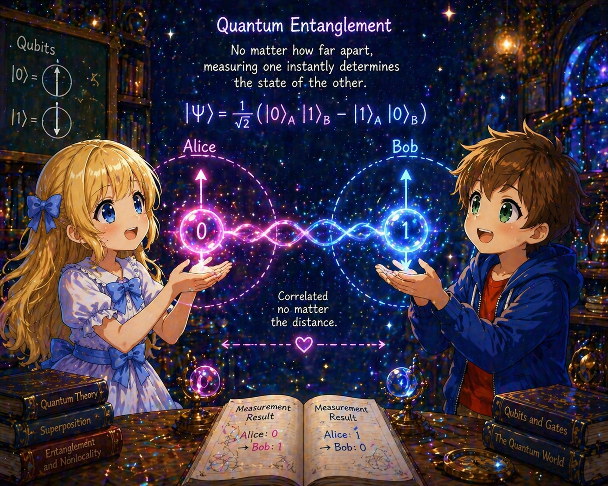

# 01: Qubit

## Comparison with Classical Bits

The basic unit of a classical computer is the **bit**, which takes one of two values: 0 or 1.

The basic unit of a quantum computer is the **qubit (quantum bit)**. A qubit can exist in a **superposition** of 0 and 1.

## State of a Qubit

The general state of a qubit can be written as:

$$
\vert\psi\rangle = \alpha\vert 0\rangle + \beta\vert 1\rangle
$$

where:
- $\vert 0\rangle$ and $\vert 1\rangle$ are the fundamental states called the **computational basis**
- $\alpha, \beta$ are **complex** probability amplitudes
- The **normalization condition** $\lvert\alpha\rvert^2 + \lvert\beta\rvert^2 = 1$ must be satisfied

### Dirac Notation (Bra-ket Notation)

In quantum mechanics, **Dirac notation** is used:

- $\vert\ \rangle$: **ket** — corresponds to a column vector
- $\langle\ \vert$: **bra** — corresponds to a row vector (the adjoint of a ket)

Written explicitly as vectors:

$$
\vert 0\rangle = \begin{pmatrix} 1 \\\\ 0 \end{pmatrix}, \quad
\vert 1\rangle = \begin{pmatrix} 0 \\\\ 1 \end{pmatrix}
$$

Therefore, a general qubit state is:

$$
\vert\psi\rangle = \alpha \begin{pmatrix} 1 \\\\ 0 \end{pmatrix} + \beta \begin{pmatrix} 0 \\\\ 1 \end{pmatrix} = \begin{pmatrix} \alpha \\\\ \beta \end{pmatrix}
$$

## Measurement

When a qubit is **measured** in the computational basis:
- $\vert 0\rangle$ is obtained with probability $\lvert\alpha\rvert^2$
- $\vert 1\rangle$ is obtained with probability $\lvert\beta\rvert^2$

After measurement, the qubit state is **projected (collapsed)** onto the basis state corresponding to the measurement result. This is an irreversible operation, and the superposition state before measurement is lost.

### Example

When measuring the state $\vert\psi\rangle = \frac{1}{\sqrt{2}}\vert 0\rangle + \frac{1}{\sqrt{2}}\vert 1\rangle$:
- $\vert 0\rangle$ with probability $\left\lvert\frac{1}{\sqrt{2}}\right\rvert^2 = \frac{1}{2}$
- $\vert 1\rangle$ with probability $\left\lvert\frac{1}{\sqrt{2}}\right\rvert^2 = \frac{1}{2}$

This is equivalent to a "fair coin toss."

## Bloch Sphere

Considering the normalization condition and the freedom of the global phase, the state of a single qubit can be described by two real parameters:

$$
\vert\psi\rangle = \cos\frac{\theta}{2}\vert 0\rangle + e^{i\phi}\sin\frac{\theta}{2}\vert 1\rangle
$$

where $0 \le \theta \le \pi$ and $0 \le \phi \lt 2\pi$.

This corresponds one-to-one to a point on the unit sphere, which is called the **Bloch sphere**:
- North pole ($\theta = 0$): $\vert 0\rangle$
- South pole ($\theta = \pi$): $\vert 1\rangle$
- On the equator ($\theta = \pi/2$): equal superposition of $\vert 0\rangle$ and $\vert 1\rangle$

The Bloch sphere is a powerful tool for visually understanding the state of a single qubit.

> **Reference:** Bloch sphere physics notes — https://t-ishii66.github.io/quantum-spin-notes/

## Multiple Qubits

The state of $n$ qubits is described in a $2^n$-dimensional complex vector space.

### Two-Qubit Case

The computational basis for two qubits consists of four states: $\vert 00\rangle, \vert 01\rangle, \vert 10\rangle, \vert 11\rangle$.

**Bit ordering convention:** In these notes, following the standard convention of quantum computing textbooks (Nielsen & Chuang, etc.), qubits are numbered **from left to right** as $q_1, q_2, \ldots$. For two qubits, we write $\vert q_1 q_2\rangle$:

- $q_1$: written on the left. **First qubit**
- $q_2$: written on the right. **Second qubit**

$\vert ab\rangle$ is read in the same order as ordinary binary numbers. $\vert 10\rangle$ corresponds to decimal 2, and $\vert 01\rangle$ corresponds to decimal 1.

> **Note on difference from computer science convention:** In computer science, bits are often counted 0-indexed from the right (least significant) as $b_0, b_1, \ldots$. Also, Qiskit numbers qubits from the right as `q[0], q[1], ...`. The convention in these notes is the **reverse** of these. We adopted the textbook convention to avoid confusion when reading textbooks and papers.

The general state is:

$$
\vert\psi\rangle = \alpha_{00}\vert 00\rangle + \alpha_{01}\vert 01\rangle + \alpha_{10}\vert 10\rangle + \alpha_{11}\vert 11\rangle
$$

Upon measurement, $\vert 00\rangle$ is obtained with probability $\lvert\alpha_{00}\rvert^2$, $\vert 01\rangle$ with probability $\lvert\alpha_{01}\rvert^2$, $\vert 10\rangle$ with probability $\lvert\alpha_{10}\rvert^2$, and $\vert 11\rangle$ with probability $\lvert\alpha_{11}\rvert^2$. The normalization condition is $\lvert\alpha_{00}\rvert^2 + \lvert\alpha_{01}\rvert^2 + \lvert\alpha_{10}\rvert^2 + \lvert\alpha_{11}\rvert^2 = 1$.

### Tensor Product

The composite system of two independent qubits is represented by the **tensor product** $\otimes$.

#### Definition

The tensor product of $\vert\psi_1\rangle = \alpha\vert 0\rangle + \beta\vert 1\rangle$ and $\vert\psi_2\rangle = \gamma\vert 0\rangle + \delta\vert 1\rangle$ is:

$$
\vert\psi_1\rangle \otimes \vert\psi_2\rangle = \alpha\gamma\vert 00\rangle + \alpha\delta\vert 01\rangle + \beta\gamma\vert 10\rangle + \beta\delta\vert 11\rangle
$$

Here $\vert 00\rangle$ is shorthand for $\vert 0\rangle \otimes \vert 0\rangle$. It is also written as $\vert\psi_1\rangle\vert\psi_2\rangle$ or $\vert\psi_1 \psi_2\rangle$.

#### Vector Representation

The tensor product corresponds to the **Kronecker product** of vectors:

$$
\vert 0\rangle \otimes \vert 0\rangle = \begin{pmatrix} 1 \\\\ 0 \end{pmatrix} \otimes \begin{pmatrix} 1 \\\\ 0 \end{pmatrix} = \begin{pmatrix} 1 \cdot \begin{pmatrix} 1 \\\\ 0 \end{pmatrix} \\\\ 0 \cdot \begin{pmatrix} 1 \\\\ 0 \end{pmatrix} \end{pmatrix} = \begin{pmatrix} 1 \\\\ 0 \\\\ 0 \\\\ 0 \end{pmatrix}
$$

$\vert 01\rangle$ can be expanded in the same way. The first qubit $q_1 = 0$ and the second qubit $q_2 = 1$:

$$
\vert 0\rangle \otimes \vert 1\rangle = \begin{pmatrix} 1 \\\\ 0 \end{pmatrix} \otimes \begin{pmatrix} 0 \\\\ 1 \end{pmatrix} = \begin{pmatrix} 1 \cdot \begin{pmatrix} 0 \\\\ 1 \end{pmatrix} \\\\ 0 \cdot \begin{pmatrix} 0 \\\\ 1 \end{pmatrix} \end{pmatrix} = \begin{pmatrix} 0 \\\\ 1 \\\\ 0 \\\\ 0 \end{pmatrix}
$$

The rule for the Kronecker product is "multiply the entire right vector by each component of the left vector." For $\vert 00\rangle$, the right vector was $(1, 0)^T$, so 1 appears at the first position of the upper half. For $\vert 01\rangle$, the right vector changed to $(0, 1)^T$, so 1 appears at the second position within the upper half.

The remaining two are computed using the same rule:

$$
\vert 10\rangle = \begin{pmatrix} 0 \\\\ 0 \\\\ 1 \\\\ 0 \end{pmatrix}, \quad
\vert 11\rangle = \begin{pmatrix} 0 \\\\ 0 \\\\ 0 \\\\ 1 \end{pmatrix}
$$

These form the computational basis of the $2^2 = 4$-dimensional space.

#### Concrete Example

Tensor product of $\vert\psi_1\rangle = \vert +\rangle = \frac{\vert 0\rangle + \vert 1\rangle}{\sqrt{2}}$ and $\vert\psi_2\rangle = \vert 0\rangle$:

$$
\vert +\rangle \otimes \vert 0\rangle = \frac{1}{\sqrt{2}}(\vert 0\rangle + \vert 1\rangle) \otimes \vert 0\rangle = \frac{\vert 00\rangle + \vert 10\rangle}{\sqrt{2}}
$$

When this state is measured, $\vert 00\rangle$ and $\vert 10\rangle$ are obtained with probability $1/2$ each. The second qubit $q_2$ is always 0, and the two bits behave **independently**.

#### Properties of the Tensor Product

- **Bilinearity:** $(\alpha\vert\psi\rangle) \otimes \vert\phi\rangle = \alpha(\vert\psi\rangle \otimes \vert\phi\rangle)$
- **Distributive law:** $(\vert\psi_1\rangle + \vert\psi_2\rangle) \otimes \vert\phi\rangle = \vert\psi_1\rangle \otimes \vert\phi\rangle + \vert\psi_2\rangle \otimes \vert\phi\rangle$
- **Non-commutative:** In general, $\vert\psi\rangle \otimes \vert\phi\rangle \neq \vert\phi\rangle \otimes \vert\psi\rangle$ (the order of bits matters)

#### Tensor Product of Operators

In a two-qubit system, operators (gates) are also constructed using tensor products. When we write $A \otimes B$, $A$ acts on the first qubit $q_1$ (left) and $B$ acts on the second qubit $q_2$ (right).

**Rule of action:** $A \otimes B$ acts "independently on each bit" on the tensor product of states:

$$
(A \otimes B)(\vert\psi\rangle \otimes \vert\phi\rangle) = (A\vert\psi\rangle) \otimes (B\vert\phi\rangle)
$$

The left operator acts on the left state, and the right operator acts on the right state.

**Concrete example:** Consider applying $X$ (NOT) to the first qubit $q_1$ and doing nothing ($I$) to the second qubit $q_2$.

$$
(X \otimes I)\vert 00\rangle = (X \otimes I)(\vert 0\rangle \otimes \vert 0\rangle) = (X\vert 0\rangle) \otimes (I\vert 0\rangle) = \vert 1\rangle \otimes \vert 0\rangle = \vert 10\rangle
$$

Only the first qubit $q_1$ is flipped, and the second qubit $q_2$ remains unchanged.

Verification with another input:

$$
(X \otimes I)\vert 01\rangle = (X\vert 0\rangle) \otimes (I\vert 1\rangle) = \vert 1\rangle \otimes \vert 1\rangle = \vert 11\rangle
$$

**Example of acting on both bits simultaneously:** Apply $X$ to the first qubit $q_1$ and $H$ to the second qubit $q_2$.

$$
(X \otimes H)\vert 00\rangle = (X\vert 0\rangle) \otimes (H\vert 0\rangle) = \vert 1\rangle \otimes \frac{\vert 0\rangle + \vert 1\rangle}{\sqrt{2}} = \frac{\vert 10\rangle + \vert 11\rangle}{\sqrt{2}}
$$

The first qubit $q_1$ is flipped from $\vert 0\rangle \to \vert 1\rangle$, and the second qubit $q_2$ becomes the superposition state $\vert 0\rangle \to \vert +\rangle$. The result is a product state, and the two bits change independently.

**Matrix representation:** The matrix of $A \otimes B$ is also computed using the Kronecker product. For example, $X \otimes I$ is:

$$
X \otimes I = \begin{pmatrix} 0 & 1 \\\\ 1 & 0 \end{pmatrix} \otimes \begin{pmatrix} 1 & 0 \\\\ 0 & 1 \end{pmatrix} = \begin{pmatrix} 0 \cdot I & 1 \cdot I \\\\ 1 \cdot I & 0 \cdot I \end{pmatrix} = \begin{pmatrix} 0 & 0 & 1 & 0 \\\\ 0 & 0 & 0 & 1 \\\\ 1 & 0 & 0 & 0 \\\\ 0 & 1 & 0 & 0 \end{pmatrix}
$$

Multiplying this $4 \times 4$ matrix by $\vert 00\rangle = (1,0,0,0)^T$ gives $(0,0,1,0)^T = \vert 10\rangle$, consistent with the calculation above.

> **Note:** Gates like CNOT, where "the operation on the target bit changes depending on the value of the control bit," cannot be written in the form $A \otimes B$. This is an operation that creates correlation between two bits and is a source of entanglement. CNOT is covered in detail in the quantum gates note (02).

### Quantum Entanglement — Introduction

Among two-qubit states, there are those that can be written as tensor products and those that cannot.

#### Product State (can be written as a tensor product)

$$
\vert\psi\rangle = \frac{\vert 00\rangle + \vert 10\rangle}{\sqrt{2}} = \frac{\vert 0\rangle + \vert 1\rangle}{\sqrt{2}} \otimes \vert 0\rangle = \vert +\rangle\vert 0\rangle
$$

In this state, the first qubit $q_1$ and the second qubit $q_2$ can be described independently. Measuring one does not affect the state of the other.

#### Entangled State (cannot be written as a tensor product)

Consider the following state:

$$
\vert\Phi^+\rangle = \frac{\vert 00\rangle + \vert 11\rangle}{\sqrt{2}}
$$

If we try to write this in the form $(\alpha\vert 0\rangle + \beta\vert 1\rangle) \otimes (\gamma\vert 0\rangle + \delta\vert 1\rangle)$:

$$
\alpha\gamma = \frac{1}{\sqrt{2}}, \quad \alpha\delta = 0, \quad \beta\gamma = 0, \quad \beta\delta = \frac{1}{\sqrt{2}}
$$

From $\alpha\delta = 0$, either $\alpha = 0$ or $\delta = 0$, but in either case it is impossible to make both $\alpha\gamma$ and $\beta\delta$ equal to $\frac{1}{\sqrt{2}}$. Therefore, this state cannot be decomposed into a tensor product.

Such a state is called an **entangled state (quantum entanglement)**.

#### Bell States

The most important examples of entangled states are the **Bell states**, which are "maximally entangled" two-qubit states:

$$
\vert\Phi^+\rangle = \frac{\vert 00\rangle + \vert 11\rangle}{\sqrt{2}}, \quad \vert\Phi^-\rangle = \frac{\vert 00\rangle - \vert 11\rangle}{\sqrt{2}}
$$

$$
\vert\Psi^+\rangle = \frac{\vert 01\rangle + \vert 10\rangle}{\sqrt{2}}, \quad \vert\Psi^-\rangle = \frac{\vert 01\rangle - \vert 10\rangle}{\sqrt{2}}
$$

The four Bell states form an orthonormal basis for the two-qubit space (the **Bell basis**).

#### Partial Measurement and the Effect of Entanglement

Measuring the first qubit $q_1$ of $\vert\Phi^+\rangle = \frac{\vert 00\rangle + \vert 11\rangle}{\sqrt{2}}$:

- **If $\vert 0\rangle$ is obtained (probability $1/2$):** The overall state is projected onto $\vert 00\rangle$. The second qubit $q_2$ is certainly $\vert 0\rangle$.
- **If $\vert 1\rangle$ is obtained (probability $1/2$):** The overall state is projected onto $\vert 11\rangle$. The second qubit $q_2$ is certainly $\vert 1\rangle$.

In other words, an observer who learns the measurement result of $q_1$ can predict the state of $q_2$ as $\vert 0\rangle$ or $\vert 1\rangle$ conditioned on that result. Before measurement, the state of $q_2$ alone is not determined, and it is only fixed by the measurement result of $q_1$. This is the essential characteristic of entanglement. However, the measurement statistics of $q_2$ alone are the same regardless of whether $q_1$ is measured or not ($\vert 0\rangle$ and $\vert 1\rangle$ each with probability $1/2$), and information cannot be sent using this correlation alone.

Comparing with the product state $\vert +\rangle\vert 0\rangle = \frac{\vert 00\rangle + \vert 10\rangle}{\sqrt{2}}$ makes the difference clear. In this case:

- **If $\vert 0\rangle$ is obtained (probability $1/2$):** $q_2$ is $\vert 0\rangle$.
- **If $\vert 1\rangle$ is obtained (probability $1/2$):** $q_2$ is $\vert 0\rangle$.

In both cases, $q_2$ is $\vert 0\rangle$ and **does not depend** on the measurement result of $q_1$.

> The physical meaning and applications of entanglement (quantum teleportation, Bell's inequality, etc.) are covered in detail in later notes.

## Summary

| Concept | Classical Bit | Qubit |
|------|-----------|-----------|
| Possible values | 0 or 1 | $\alpha\vert 0\rangle + \beta\vert 1\rangle$ |
| Information content | 1 bit | Only 1 bit obtained per measurement |
| State space | $\{0, 1\}$ (discrete) | Bloch sphere surface (pure states, continuous) |
| Copying | Freely copyable | Complete copying of an unknown arbitrary state is impossible (no-cloning theorem) |
