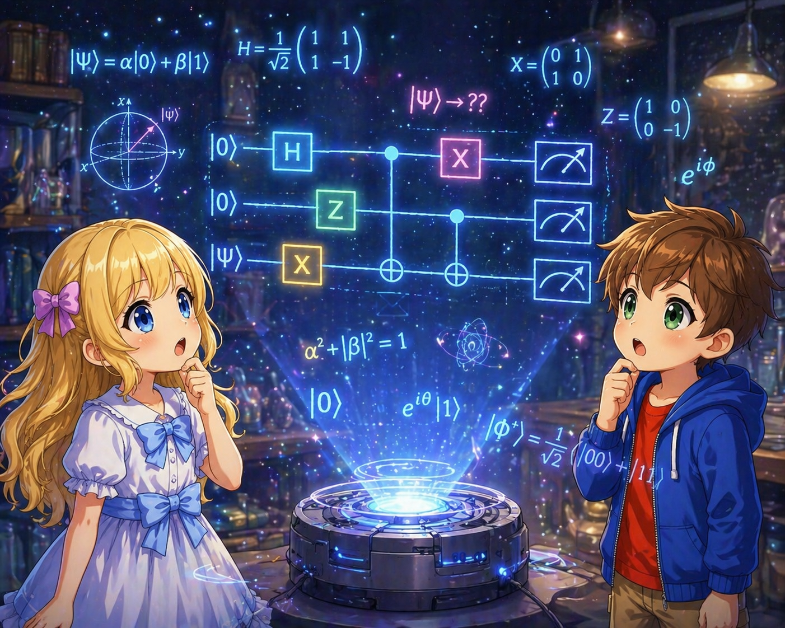
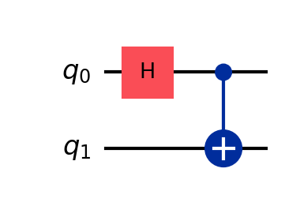
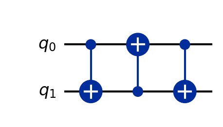
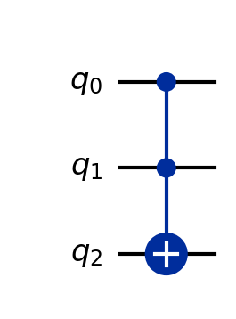

# 02: Quantum Gates

## What are Quantum Gates?

In classical computers, logic gates (AND, OR, NOT, etc.) are used to manipulate bits. In quantum computers, the corresponding operations are **quantum gates**.

A quantum gate is represented by a **unitary matrix** $U$ that acts on the state vector of a qubit:

$$
\vert\psi'\rangle = U\vert\psi\rangle
$$

### Conditions for a Unitary Matrix

A matrix $U$ is unitary if it satisfies:

$$
U^\dagger U = U U^\dagger = I
$$

Here $U^\dagger$ is the adjoint (conjugate transpose) of $U$, and $I$ is the identity matrix.

This condition ensures:
- **Normalization of the state vector is preserved** (the total probability is always 1)
- **Reversibility is guaranteed** (since $U^{-1} = U^\dagger$, an inverse operation always exists)

Classical logic gates (e.g., AND) can be irreversible, but quantum gates are always reversible.

---

## Single-Qubit Gates

### Pauli Gates

The Pauli gates are the most fundamental quantum gates and correspond to rotations on the Bloch sphere.

#### Pauli X Gate (NOT Gate)

$$
X = \begin{pmatrix} 0 & 1 \\\\ 1 & 0 \end{pmatrix}
$$

Swaps $\vert 0\rangle$ and $\vert 1\rangle$. Equivalent to the classical NOT gate.

$$
X\vert 0\rangle = \begin{pmatrix} 0 & 1 \\\\ 1 & 0 \end{pmatrix} \begin{pmatrix} 1 \\\\ 0 \end{pmatrix} = \begin{pmatrix} 0 \\\\ 1 \end{pmatrix} = \vert 1\rangle
$$

$$
X\vert 1\rangle = \begin{pmatrix} 0 & 1 \\\\ 1 & 0 \end{pmatrix} \begin{pmatrix} 0 \\\\ 1 \end{pmatrix} = \begin{pmatrix} 1 \\\\ 0 \end{pmatrix} = \vert 0\rangle
$$

**Bloch sphere interpretation:** $\pi$ rotation about the X axis. The north pole $\vert 0\rangle$ and south pole $\vert 1\rangle$ are swapped.

#### Pauli Y Gate

$$
Y = \begin{pmatrix} 0 & -i \\\\ i & 0 \end{pmatrix}
$$

$$
Y\vert 0\rangle = \begin{pmatrix} 0 & -i \\\\ i & 0 \end{pmatrix} \begin{pmatrix} 1 \\\\ 0 \end{pmatrix} = \begin{pmatrix} 0 \\\\ i \end{pmatrix} = i\vert 1\rangle
$$

$$
Y\vert 1\rangle = \begin{pmatrix} 0 & -i \\\\ i & 0 \end{pmatrix} \begin{pmatrix} 0 \\\\ 1 \end{pmatrix} = \begin{pmatrix} -i \\\\ 0 \end{pmatrix} = -i\vert 0\rangle
$$

**Bloch sphere interpretation:** $\pi$ rotation about the Y axis.

#### Pauli Z Gate

$$
Z = \begin{pmatrix} 1 & 0 \\\\ 0 & -1 \end{pmatrix}
$$

$$
Z\vert 0\rangle = \vert 0\rangle, \quad Z\vert 1\rangle = -\vert 1\rangle
$$

$\vert 0\rangle$ is unchanged, and the phase of $\vert 1\rangle$ is flipped. The bit value does not change, but the **phase** changes.

**Concrete example:** Applying Z to a superposition state:

$$
Z\left(\frac{\vert 0\rangle + \vert 1\rangle}{\sqrt{2}}\right) = \frac{\vert 0\rangle - \vert 1\rangle}{\sqrt{2}}
$$

The measurement probabilities do not change (both $1/2$), but the phase has changed. This difference produces observable effects when combined with other gates.

**Bloch sphere interpretation:** $\pi$ rotation about the Z axis. Points on the equator move to the opposite side.

#### Properties of the Pauli Matrices

The three Pauli matrices have the following important properties:

- **Hermiticity:** $X^\dagger = X$, $Y^\dagger = Y$, $Z^\dagger = Z$ (each is its own adjoint)
- **Square to identity:** $X^2 = Y^2 = Z^2 = I$ (applying twice returns to the original. This implies $X^{-1} = X$, etc.)
- **Product relations:** $XY = iZ$, $YZ = iX$, $ZX = iY$ (reversing the order changes the sign. For example, $YX = -iZ$)

---

### Hadamard Gate

One of the most frequently used gates in quantum computation. Creates superposition states.

$$
H = \frac{1}{\sqrt{2}} \begin{pmatrix} 1 & 1 \\\\ 1 & -1 \end{pmatrix}
$$

#### Action on Computational Basis

$$
H\vert 0\rangle = \frac{1}{\sqrt{2}}(\vert 0\rangle + \vert 1\rangle) \equiv \vert +\rangle
$$

$$
H\vert 1\rangle = \frac{1}{\sqrt{2}}(\vert 0\rangle - \vert 1\rangle) \equiv \vert -\rangle
$$

From $\vert 0\rangle$, an equal superposition $\vert +\rangle$ is created, and from $\vert 1\rangle$, a superposition with different phase $\vert -\rangle$ is created.

$\vert +\rangle$ and $\vert -\rangle$ are called the **Hadamard basis** (or $\pm$ basis).

#### Action on Superposition Basis

$$
H\vert +\rangle = \vert 0\rangle, \quad H\vert -\rangle = \vert 1\rangle
$$

In other words, the Hadamard gate performs a **transformation between the computational basis and the Hadamard basis**. Applying it twice returns to the original:

$$
H^2 = I
$$

#### Concrete Example: Verification by Matrix Calculation

$$
H\vert 0\rangle = \frac{1}{\sqrt{2}} \begin{pmatrix} 1 & 1 \\\\ 1 & -1 \end{pmatrix} \begin{pmatrix} 1 \\\\ 0 \end{pmatrix} = \frac{1}{\sqrt{2}} \begin{pmatrix} 1 \\\\ 1 \end{pmatrix} = \frac{1}{\sqrt{2}}\vert 0\rangle + \frac{1}{\sqrt{2}}\vert 1\rangle
$$

**Bloch sphere interpretation:** $\pi$ rotation about the axis midway between the X and Z axes. The north pole $\vert 0\rangle$ moves to $\vert +\rangle$ on the equator.

---

### Phase Gates

A family of gates that add a phase to the $\vert 1\rangle$ component. The $\vert 0\rangle$ component is unchanged.

#### General Phase Gate $R_\phi$

$$
R_\phi = \begin{pmatrix} 1 & 0 \\\\ 0 & e^{i\phi} \end{pmatrix}
$$

$$
R_\phi(\alpha\vert 0\rangle + \beta\vert 1\rangle) = \alpha\vert 0\rangle + \beta e^{i\phi}\vert 1\rangle
$$

#### S Gate (π/2 Phase Gate)

$$
S = \begin{pmatrix} 1 & 0 \\\\ 0 & i \end{pmatrix}
$$

Adds phase $i = e^{i\pi/2}$ to $\vert 1\rangle$. The relation $S^2 = Z$ holds.

#### T Gate (π/4 Phase Gate)

$$
T = \begin{pmatrix} 1 & 0 \\\\ 0 & e^{i\pi/4} \end{pmatrix}
$$

The relations $T^2 = S$ and $T^4 = Z$ hold.

The T gate has special importance in **fault-tolerant quantum computation**. In many error-correcting codes, implementing the T gate is the most costly operation.

#### Concrete Example: Action of the S Gate

Applying the S gate to $\vert +\rangle$:

$$
S\vert +\rangle = S \cdot \frac{\vert 0\rangle + \vert 1\rangle}{\sqrt{2}} = \frac{\vert 0\rangle + i\vert 1\rangle}{\sqrt{2}}
$$

On the Bloch sphere, this corresponds to a state where a point on the equator has been rotated by $\pi/2$.

---

### Rotation Gates

These represent rotations by an arbitrary angle about each axis of the Bloch sphere. While Pauli gates were fixed operations of "$\pi$ rotation," rotation gates are continuous operations that take an arbitrary angle $\theta$ as a parameter.

#### Why This is a "Rotation" — Derivation from the Matrix Exponential

Rotation gates may appear to be given in an ad hoc manner, but they are actually derived naturally from the Pauli matrices.

A Pauli matrix $\sigma$ (any of $X, Y, Z$) is Hermitian ($\sigma^\dagger = \sigma$) and satisfies $\sigma^2 = I$. Using $\sigma$ as the rotation axis and $\theta$ as the rotation angle, we define

$$
R_\sigma(\theta) \;\equiv\; e^{-i\frac{\theta}{2}\sigma}
$$

$R_\sigma(\theta)$ means "the unitary matrix that rotates by angle $\theta$ about the axis represented by the Pauli matrix $\sigma$ on the Bloch sphere." For example, $R_X(\pi/2)$ is the operation of rotating 90° about the X axis (see the [Bloch sphere physics notes](https://t-ishii66.github.io/quantum-spin-notes/) for details).

That this matrix is unitary follows immediately from $\sigma^\dagger = \sigma$ ($R^\dagger R = e^{+i\frac{\theta}{2}\sigma} e^{-i\frac{\theta}{2}\sigma} = I$). The reason $\theta/2$ appears in the exponent instead of $\theta$ is explained in detail in the "half-angle mystery" below.

Using $\sigma^2 = I$, this matrix exponential can be expressed in terms of elementary functions. Since powers of $\sigma$ alternate between $I$ and $\sigma$, separating the Taylor expansion into even terms ($\sigma^{2k} = I$) and odd terms ($\sigma^{2k+1} = \sigma$):

$$
e^{-i\frac{\theta}{2}\sigma} = \left[\sum_{k=0}^{\infty} \frac{(-1)^k}{(2k)!}\left(\frac{\theta}{2}\right)^{2k}\right] I \;-\; i\left[\sum_{k=0}^{\infty} \frac{(-1)^k}{(2k+1)!}\left(\frac{\theta}{2}\right)^{2k+1}\right] \sigma
$$

The expressions in brackets are exactly the Taylor expansions of $\cos(\theta/2)$ and $\sin(\theta/2)$, respectively. Therefore:

$$
R_\sigma(\theta) \;=\; \cos\!\frac{\theta}{2}\, I \;-\; i\sin\!\frac{\theta}{2}\, \sigma
$$

This is the matrix version of Euler's formula $e^{i\alpha} = \cos\alpha + i\sin\alpha$. Substituting $\sigma = X, Y, Z$ gives the three rotation matrices.

#### Rotation Matrices About Each Axis

**$R_x(\theta)$:** Substitute $\sigma = X$.

$$
R_x(\theta) = \cos\frac{\theta}{2}\, I - i\sin\frac{\theta}{2}\, X = \cos\frac{\theta}{2} \begin{pmatrix} 1 & 0 \\\\ 0 & 1 \end{pmatrix} - i\sin\frac{\theta}{2} \begin{pmatrix} 0 & 1 \\\\ 1 & 0 \end{pmatrix} = \begin{pmatrix} \cos\frac{\theta}{2} & -i\sin\frac{\theta}{2} \\\\ -i\sin\frac{\theta}{2} & \cos\frac{\theta}{2} \end{pmatrix}
$$

**$R_y(\theta)$:** Substitute $\sigma = Y$. Noting that $-iY = -i\begin{pmatrix} 0 & -i \\\\ i & 0 \end{pmatrix} = \begin{pmatrix} 0 & -1 \\\\ 1 & 0 \end{pmatrix}$:

$$
R_y(\theta) = \cos\frac{\theta}{2}\, I - i\sin\frac{\theta}{2}\, Y = \begin{pmatrix} \cos\frac{\theta}{2} & -\sin\frac{\theta}{2} \\\\ \sin\frac{\theta}{2} & \cos\frac{\theta}{2} \end{pmatrix}
$$

**$R_z(\theta)$:** Substitute $\sigma = Z$. The diagonal entries are $\cos(\theta/2) \mp i\sin(\theta/2) = e^{\mp i\theta/2}$ (by Euler's formula):

$$
R_z(\theta) = \cos\frac{\theta}{2}\, I - i\sin\frac{\theta}{2}\, Z = \begin{pmatrix} e^{-i\theta/2} & 0 \\\\ 0 & e^{i\theta/2} \end{pmatrix}
$$

#### Concrete Examples: Action on |0⟩ and |1⟩

We compute the case $\theta = \pi/2$ (90-degree rotation). Using $\cos\frac{\pi}{4} = \sin\frac{\pi}{4} = \frac{1}{\sqrt{2}}$.

**Action of $R_x(\pi/2)$:**

$$
R_x\!\left(\frac{\pi}{2}\right) = \begin{pmatrix} \frac{1}{\sqrt{2}} & \frac{-i}{\sqrt{2}} \\\\ \frac{-i}{\sqrt{2}} & \frac{1}{\sqrt{2}} \end{pmatrix}
$$

$$
R_x\!\left(\frac{\pi}{2}\right)\vert 0\rangle = \begin{pmatrix} \frac{1}{\sqrt{2}} & \frac{-i}{\sqrt{2}} \\\\ \frac{-i}{\sqrt{2}} & \frac{1}{\sqrt{2}} \end{pmatrix} \begin{pmatrix} 1 \\\\ 0 \end{pmatrix} = \begin{pmatrix} \frac{1}{\sqrt{2}} \\\\ \frac{-i}{\sqrt{2}} \end{pmatrix} = \frac{1}{\sqrt{2}}\vert 0\rangle - \frac{i}{\sqrt{2}}\vert 1\rangle
$$

$$
R_x\!\left(\frac{\pi}{2}\right)\vert 1\rangle = \begin{pmatrix} \frac{1}{\sqrt{2}} & \frac{-i}{\sqrt{2}} \\\\ \frac{-i}{\sqrt{2}} & \frac{1}{\sqrt{2}} \end{pmatrix} \begin{pmatrix} 0 \\\\ 1 \end{pmatrix} = \begin{pmatrix} \frac{-i}{\sqrt{2}} \\\\ \frac{1}{\sqrt{2}} \end{pmatrix} = -\frac{i}{\sqrt{2}}\vert 0\rangle + \frac{1}{\sqrt{2}}\vert 1\rangle
$$

From $\vert 0\rangle$ (north pole), rotating 90 degrees about the X axis moves to the equator. Measuring yields $\vert 0\rangle$ and $\vert 1\rangle$ with equal probability.

**Action of $R_y(\pi/2)$:**

$$
R_y\!\left(\frac{\pi}{2}\right) = \begin{pmatrix} \frac{1}{\sqrt{2}} & -\frac{1}{\sqrt{2}} \\\\ \frac{1}{\sqrt{2}} & \frac{1}{\sqrt{2}} \end{pmatrix}
$$

$$
R_y\!\left(\frac{\pi}{2}\right)\vert 0\rangle = \frac{1}{\sqrt{2}}\vert 0\rangle + \frac{1}{\sqrt{2}}\vert 1\rangle = \vert +\rangle
$$

$$
R_y\!\left(\frac{\pi}{2}\right)\vert 1\rangle = -\frac{1}{\sqrt{2}}\vert 0\rangle + \frac{1}{\sqrt{2}}\vert 1\rangle
$$

$R_y(\pi/2)\vert 0\rangle$ coincides with $\vert +\rangle$. The difference from $R_x$ is that the coefficients are purely real (no imaginary phase $i$ appears).

**Action of $R_z(\pi/2)$:**

$$
R_z\!\left(\frac{\pi}{2}\right) = \begin{pmatrix} e^{-i\pi/4} & 0 \\\\ 0 & e^{i\pi/4} \end{pmatrix}
$$

$$
R_z\!\left(\frac{\pi}{2}\right)\vert 0\rangle = e^{-i\pi/4}\vert 0\rangle
$$

$$
R_z\!\left(\frac{\pi}{2}\right)\vert 1\rangle = e^{i\pi/4}\vert 1\rangle
$$

Both $\vert 0\rangle$ and $\vert 1\rangle$ only acquire a global phase, and the measurement probabilities do not change. This is because points on the Z axis (north and south poles) do not move under rotation about the Z axis. The effect of $R_z$ appears when it acts on superposition states.

#### Verification That It Is Indeed a "Rotation" (Examining $R_z$)

As a final verification of the derivation, we apply $R_z(\theta)$ to a general quantum state and confirm that it indeed rotates by angle $\theta$ about the Z axis on the Bloch sphere. A state corresponding to polar angle $\eta$ and azimuthal angle $\varphi$ on the Bloch sphere is:

$$
\vert\psi\rangle = \cos\frac{\eta}{2}\vert 0\rangle + e^{i\varphi}\sin\frac{\eta}{2}\vert 1\rangle
$$

(see Note 01). Applying $R_z(\theta)$:

$$
R_z(\theta)\vert\psi\rangle = e^{-i\theta/2}\cos\frac{\eta}{2}\vert 0\rangle + e^{i\theta/2}e^{i\varphi}\sin\frac{\eta}{2}\vert 1\rangle
$$

Since the global phase $e^{-i\theta/2}$ does not affect observations, factoring it out:

$$
R_z(\theta)\vert\psi\rangle = e^{-i\theta/2}\left[\cos\frac{\eta}{2}\vert 0\rangle + e^{i(\varphi+\theta)}\sin\frac{\eta}{2}\vert 1\rangle\right]
$$

That is, the polar angle $\eta$ remains unchanged, and **only the azimuthal angle changes as $\varphi \to \varphi + \theta$**. This is precisely a rotation by angle $\theta$ about the Z axis on the Bloch sphere. For $R_x$ and $R_y$, similar calculations centered on different axes confirm that they are also "rotations."

#### The Half-Angle $\theta/2$ Mystery — Qubits as Spinors

By now, you should have noticed that $\theta/2$ appears in the matrix elements of all rotation gates. This comes from the factor of one-half in the exponent $e^{-i\theta\sigma/2}$ that appeared during the derivation, but what does it mean? Computing $R_z(2\pi)$:

$$
R_z(2\pi) = \begin{pmatrix} e^{-i\pi} & 0 \\\\ 0 & e^{i\pi} \end{pmatrix} = \begin{pmatrix} -1 & 0 \\\\ 0 & -1 \end{pmatrix} = -I
$$

On the Bloch sphere, we should have "gone around once and returned to the starting point," yet the state vector has acquired a global phase of $-1$. To return to the original state vector, one must rotate by $4\pi$ = 720°:

$$
R_z(4\pi) = I
$$

This is not a flaw in the mathematics but an essential property of qubits (spin-1/2 systems). Three-dimensional rotations (returning after 360°) and quantum state transformations (returning after 720°) have a **2-to-1** correspondence, where two unitary matrices differing by a sign, $\pm U$, correspond to the same three-dimensional rotation. This is called the **spinor double cover**. The global phase $-1$ cannot be observed for a single state in isolation. However, in situations where "rotated paths" and "unrotated paths" are superposed, such as in controlled gates or interferometers, $-1$ appears as a relative phase and affects measurement results.

#### Relationship with Pauli Gates

The Pauli gates are special cases of rotation gates (up to global phase):

$$
R_x(\pi) = -iX, \quad R_y(\pi) = -iY, \quad R_z(\pi) = -iZ
$$

---

## Two-Qubit Gates

### CNOT Gate (Controlled-NOT)

The most important two-qubit gate in quantum computation. It has a **control bit** and a **target bit**.

When the control bit is $\vert 1\rangle$, X (NOT) is applied to the target bit. When the control bit is $\vert 0\rangle$, nothing happens.

$$
\text{CNOT} = \begin{pmatrix} 1 & 0 & 0 & 0 \\\\ 0 & 1 & 0 & 0 \\\\ 0 & 0 & 0 & 1 \\\\ 0 & 0 & 1 & 0 \end{pmatrix}
$$

Here, the first qubit $q_1$ is the control and the second qubit $q_2$ is the target, written in the order $\vert q_1 q_2\rangle$.

#### Action on Computational Basis

| Input | Output | Description |
|------|------|------|
| $\vert 00\rangle$ | $\vert 00\rangle$ | Control=0 → do nothing |
| $\vert 01\rangle$ | $\vert 01\rangle$ | Control=0 → do nothing |
| $\vert 10\rangle$ | $\vert 11\rangle$ | Control=1 → flip target |
| $\vert 11\rangle$ | $\vert 10\rangle$ | Control=1 → flip target |

This corresponds to the classical XOR: the target bit becomes "control XOR target."

#### Concrete Example: Generating Entanglement

The most important application of the CNOT gate is **Bell state generation** in combination with the Hadamard gate.

Starting from the initial state $\vert 00\rangle$:

**Step 1:** Apply the Hadamard gate to the first qubit $q_1$

$$
(H \otimes I)\vert 00\rangle = \frac{\vert 0\rangle + \vert 1\rangle}{\sqrt{2}} \otimes \vert 0\rangle = \frac{\vert 00\rangle + \vert 10\rangle}{\sqrt{2}}
$$

**Step 2:** Apply CNOT ($q_1$ is control, $q_2$ is target)

$$
\text{CNOT} \cdot \frac{\vert 00\rangle + \vert 10\rangle}{\sqrt{2}} = \frac{\vert 00\rangle + \vert 11\rangle}{\sqrt{2}}
$$

The result $\frac{\vert 00\rangle + \vert 11\rangle}{\sqrt{2}}$ is called the **Bell state** $\vert\Phi^+\rangle$. This state cannot be decomposed into a tensor product, i.e., it is an entangled state.

> **Note:** In quantum circuit diagrams, qubits are conventionally **numbered from 0** from top to bottom as $q_0, q_1, q_2, \ldots$. This follows the same convention as programming array indices, and many quantum computing frameworks (Qiskit, etc.) follow this. In this diagram, $q_0, q_1$ correspond to $q_1, q_2$ in the text, respectively.

> **Verification that it cannot be decomposed into a tensor product:**
>
> $$
> (\alpha\vert 0\rangle + \beta\vert 1\rangle) \otimes (\gamma\vert 0\rangle + \delta\vert 1\rangle) = \alpha\gamma\vert 00\rangle + \alpha\delta\vert 01\rangle + \beta\gamma\vert 10\rangle + \beta\delta\vert 11\rangle
> $$
>
> The coefficients must simultaneously satisfy:
>
> $$
> \alpha\gamma = \frac{1}{\sqrt{2}}, \quad \alpha\delta = 0, \quad \beta\gamma = 0, \quad \beta\delta = \frac{1}{\sqrt{2}}
> $$
>
> However, if $\alpha\delta = 0$ and $\beta\gamma = 0$, then $\alpha\gamma\beta\delta = 0$ should hold, but
> $\alpha\gamma \cdot \beta\delta = 1/2 \neq 0$, which is a contradiction.

---

### CZ Gate (Controlled-Z)

Adds a phase of $-1$ when both the control and target bits are $\vert 1\rangle$.

$$
\text{CZ} = \begin{pmatrix} 1 & 0 & 0 & 0 \\\\ 0 & 1 & 0 & 0 \\\\ 0 & 0 & 1 & 0 \\\\ 0 & 0 & 0 & -1 \end{pmatrix}
$$

| Input | Output |
|------|------|
| $\vert 00\rangle$ | $\vert 00\rangle$ |
| $\vert 01\rangle$ | $\vert 01\rangle$ |
| $\vert 10\rangle$ | $\vert 10\rangle$ |
| $\vert 11\rangle$ | $-\vert 11\rangle$ |

The CZ gate has a symmetry: there is no distinction between control and target. The result is the same regardless of which bit is taken as the control.

---

### SWAP Gate

Exchanges the states of two qubits.

$$
\text{SWAP} = \begin{pmatrix} 1 & 0 & 0 & 0 \\\\ 0 & 0 & 1 & 0 \\\\ 0 & 1 & 0 & 0 \\\\ 0 & 0 & 0 & 1 \end{pmatrix}
$$

$$
\text{SWAP}\vert ab\rangle = \vert ba\rangle
$$

SWAP can be implemented with three CNOTs. $\text{CNOT}_{ij}$ means a CNOT with bit $q_i$ as control and $q_j$ as target.

$$
\text{SWAP} = \text{CNOT}_{12} \cdot \text{CNOT}_{21} \cdot \text{CNOT}_{12}
$$

Tracing through a concrete example reveals why this achieves a swap. For $(q_1, q_2) = (1, 0)$:

| Step | Operation | $q_1$ | $q_2$ | Description |
|------|------|:---:|:---:|------|
| Initial state | — | 1 | 0 | |
| 1 | $\text{CNOT}_{12}$ | 1 | 1 | $q_1=1$ so flip $q_2$ |
| 2 | $\text{CNOT}_{21}$ | 0 | 1 | $q_2=1$ so flip $q_1$ |
| 3 | $\text{CNOT}_{12}$ | 0 | 1 | $q_1=0$ so $q_2$ unchanged |

The result is $(0, 1)$, which is swapped. Checking other inputs:

- $(0, 0)$: Nothing happens in all 3 steps, remains $(0, 0)$
- $(1, 1)$: Sequentially $(1,0) \to (1,0) \to (1,1)$ — result is $(1, 1)$, unchanged
- $(0, 1)$: Step 1: $q_1=0$ so no change; Step 2: $q_2=1$ so flip $q_1$ → $(1, 1)$; Step 3: $q_1=1$ so flip $q_2$ → $(1, 0)$ — swap complete

In all cases, the values of $q_1$ and $q_2$ are correctly swapped.

---

## Three-Qubit Gates

### Toffoli Gate (CCNOT)

Has two control bits and one target bit. NOT is applied to the target bit only when both control bits are $\vert 1\rangle$.

| Input | Output |
|------|------|
| $\vert 110\rangle$ | $\vert 111\rangle$ |
| $\vert 111\rangle$ | $\vert 110\rangle$ |
| Others | No change |

The Toffoli gate is **classically universal**. That is, using ancilla bits (bits initialized to $\vert 0\rangle$ or $\vert 1\rangle$), all classical logic gates such as AND, OR, and NOT can be constructed from Toffoli gates.

#### Concrete Example: Implementing AND

Setting the initial value of the target bit to $\vert 0\rangle$:

$$
\text{Toffoli}\vert ab0\rangle = \vert ab(a \cdot b)\rangle
$$

The result of $a$ AND $b$ is written to the third qubit $q_3$.

---

## Universal Gate Set

When any unitary transformation can be approximated (to arbitrary precision) by combinations of a finite set of gates, that set of gates is called a **universal gate set**.

Commonly used examples of universal gate sets:

- $\{H, T, \text{CNOT}\}$
- $\{H, S, T, \text{CNOT}\}$ (redundant but practical)

It is known that any single-qubit gate can be approximated by combinations of $H$ and $T$, and adding CNOT enables approximation of any multi-qubit gate as well.

---

## Gate Identities

Basic identities useful for simplifying and understanding quantum circuits:

| Identity | Description |
|--------|------|
| $HXH = Z$ | X and Z are swapped by Hadamard |
| $HZH = X$ | The reverse of the above |
| $HYH = -Y$ | Y acquires a sign flip |
| $H = \frac{X + Z}{\sqrt{2}}$ | H is the "midpoint" of X and Z |
| $S = T^2$ | S is the square of T |
| $Z = S^2 = T^4$ | Z is the 4th power of T |
| $X = HZH$ | X is Z under basis transformation |

---

## Summary

| Gate | Number of qubits | Matrix size | Main role |
|--------|------------|-----------|---------|
| X, Y, Z | 1 | $2 \times 2$ | Fundamental rotations (Pauli operations) |
| H | 1 | $2 \times 2$ | Creating superpositions / basis transformation |
| S, T | 1 | $2 \times 2$ | Phase manipulation |
| $R_x, R_y, R_z$ | 1 | $2 \times 2$ | Rotation by arbitrary angles |
| CNOT | 2 | $4 \times 4$ | Conditional flip / entanglement generation |
| CZ | 2 | $4 \times 4$ | Conditional phase flip |
| SWAP | 2 | $4 \times 4$ | State exchange |
| Toffoli | 3 | $8 \times 8$ | Reversible implementation of classical computation |

The essence of quantum gates is **unitary transformation**, which guarantees probability conservation and reversibility. With a universal gate set like $\{H, T, \text{CNOT}\}$, any quantum computation can in principle be performed.
