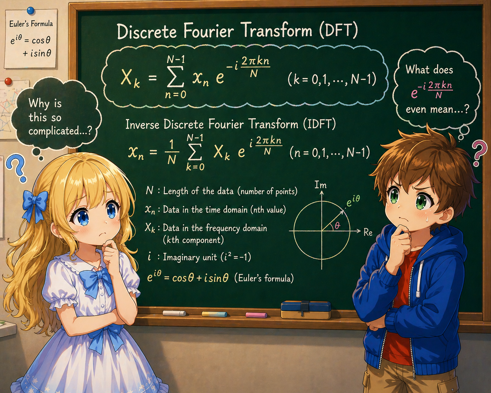

# 04: Discrete Fourier Transform (DFT)

## Why Learn the Fourier Transform?

Many important quantum computing algorithms are built on the **Quantum Fourier Transform (QFT)**. Shor's factoring algorithm and the phase estimation algorithm are representative examples.

The quantum Fourier transform is a quantum circuit realization of the classical **Discrete Fourier Transform (DFT)**. Therefore, to understand the QFT, one must first accurately understand the DFT.

This note describes everything from the definition of the DFT to concrete computational examples, without omissions.

---

## What is the Fourier Transform?

The Fourier transform is an operation that **decomposes a signal into its frequency components**.

As an everyday example, applying the Fourier transform to a music waveform (amplitude changes over time) reveals "how much of each frequency is contained in the signal."

### Continuous Fourier Transform

The Fourier transform for a continuous function $f(t)$ is defined by an integral:

$$
\hat{f}(\xi) = \int_{-\infty}^{\infty} f(t)  e^{-2\pi i \xi t}  dt
$$

The input is a continuous function $f(t)$, and the output is also a continuous function $\hat{f}(\xi)$. $\xi$ represents frequency, and $\hat{f}(\xi)$ gives "how much of frequency $\xi$ is contained." The core mechanism is taking the inner product with $e^{-2\pi i \xi t}$ (a complex sinusoid of frequency $\xi$).

### From Continuous to Discrete

In practice, data is given as a finite number of values. The **Discrete Fourier Transform (DFT)** is obtained by replacing the continuous Fourier transform with a finite, discrete setting:

| | Continuous Fourier Transform | Discrete Fourier Transform |
|--|--|--|
| Input | Continuous function $f(t)$ | $N$ numbers $x_0, x_1, \ldots, x_{N-1}$ |
| Output | Continuous function $\hat{f}(\xi)$ | $N$ numbers $X_0, X_1, \ldots, X_{N-1}$ |
| Operation | Integral $\int$ | Finite sum $\sum$ |
| Frequency | Continuous value $\xi$ | Discrete values $k = 0, 1, \ldots, N-1$ |
| Kernel | $e^{-2\pi i \xi t}$ | $\omega_N^{jk} = e^{2\pi i jk/N}$ |

The essential idea — "extracting frequency components by taking inner products with complex exponentials" — is the same; continuous is replaced by discrete, and integration by finite summation. Note that the sign of the exponent in the kernel differs between the continuous version ($-$) and the DFT ($+$); this is a difference in sign convention for the Fourier transform, and in this note we define it with the positive sign to match the convention of the Quantum Fourier Transform (QFT).

In quantum computation, we deal with $N = 2^n$ probability amplitudes (a finite number of complex numbers), so the discrete Fourier transform is sufficient. From here on, we focus exclusively on the DFT.

---

## N-th Roots of Unity

Before entering the definition of the DFT, we organize the important mathematical tool of **N-th roots of unity**.

### Definition

Define $\omega_N$ as follows:

$$
\omega_N = e^{2\pi i / N}
$$

This is the first point encountered going counterclockwise among the points that divide the unit circle on the complex plane into $N$ equal parts.

The $k$-th power $\omega_N^k = e^{2\pi i k / N}$ gives the $N$ equally spaced points on the unit circle in order.

### Concrete Examples

**Case $N = 4$:**

$$
\omega_4 = e^{2\pi i / 4} = e^{i\pi/2} = i
$$

The four 4th roots of unity are:

$$
\omega_4^0 = 1, \quad \omega_4^1 = i, \quad \omega_4^2 = -1, \quad \omega_4^3 = -i
$$

On the complex plane, these are the points dividing the unit circle into 4 equal parts (counterclockwise from the positive real axis: $1, i, -1, -i$).

**Case $N = 2$:**

$$
\omega_2 = e^{2\pi i / 2} = e^{i\pi} = -1
$$

The two square roots of unity are:

$$
\omega_2^0 = 1, \quad \omega_2^1 = -1
$$

### Important Properties

The N-th roots of unity have the following properties. These are used repeatedly in the theory of the DFT.

#### Periodicity

$$
\omega_N^{k+N} = \omega_N^k
$$

This follows from $e^{2\pi i (k+N)/N} = e^{2\pi i k/N} \cdot e^{2\pi i} = e^{2\pi i k/N} \cdot 1$. The value does not change when the exponent increases by $N$.

#### Orthogonality Relation (Most Important)

$$
\frac{1}{N} \sum_{j=0}^{N-1} \omega_N^{j(k - k')} = \frac{1}{N} \sum_{j=0}^{N-1} e^{2\pi i  j(k - k') / N} = \delta_{k,k'}
$$

Here $\delta_{k,k'}$ is the Kronecker delta, which equals 1 when $k \equiv k' \pmod{N}$ and 0 otherwise. The middle expression substitutes the definition $\omega_N = e^{2\pi i/N}$.

Intuitively, when $k \neq k'$, $\omega_N^{j(k-k')}$ traces $N$ equally spaced points on the unit circle. Since these points are symmetrically arranged on the circumference, adding them as complex numbers results in exact cancellation to 0.

**Proof:**

When $k = k'$, $\omega_N^{j \cdot 0} = 1$, so the sum is $N$, and multiplying by $1/N$ gives 1.

When $k \neq k'$, let $m = k - k' \not\equiv 0 \pmod{N}$:

$$
\sum_{j=0}^{N-1} \omega_N^{jm} = \sum_{j=0}^{N-1} (\omega_N^m)^j
$$

This is a geometric series with first term 1 and common ratio $\omega_N^m$:

$$
\sum_{j=0}^{N-1} (\omega_N^m)^j = \frac{1 - (\omega_N^m)^N}{1 - \omega_N^m} = \frac{1 - \omega_N^{mN}}{1 - \omega_N^m} = \frac{1 - (e^{2\pi i})^m}{1 - \omega_N^m} = \frac{1 - 1}{1 - \omega_N^m} = 0
$$

The denominator $1 - \omega_N^m \neq 0$ is guaranteed by $m \not\equiv 0 \pmod{N}$.

This orthogonality relation is the basis for the **invertibility** of the Fourier transform (the existence of an inverse transform).

---

## Definition of the Discrete Fourier Transform

### Forward Transform

Given a sequence of $N$ complex numbers $x_0, x_1, \ldots, x_{N-1}$, the **Discrete Fourier Transform** $X_0, X_1, \ldots, X_{N-1}$ is defined as:

$$
X_k = \frac{1}{\sqrt{N}} \sum_{j=0}^{N-1} x_j  \omega_N^{jk} \qquad (k = 0, 1, \ldots, N-1)
$$

where $\omega_N = e^{2\pi i / N}$.

Each $X_k$ corresponds to the "frequency $k$ component" of the input sequence $x_j$.

> **Note on normalization:** There are different conventions for defining the DFT. In engineering, $1/N$ is often placed on the forward transform, while in physics, $1/\sqrt{N}$ is placed on both. In this note, following the convention of quantum computation, we adopt the **symmetric normalization** with $1/\sqrt{N}$ on both the forward and inverse transforms.

### Inverse Transform

The inverse discrete Fourier transform is given by:

$$
x_j = \frac{1}{\sqrt{N}} \sum_{k=0}^{N-1} X_k  \omega_N^{-jk} \qquad (j = 0, 1, \ldots, N-1)
$$

The only difference from the forward transform is that $\omega_N^{jk}$ is replaced by $\omega_N^{-jk}$ (the sign of the exponent is reversed).

### Verification that the Inverse Transform is Correct

We substitute the definition of the forward transform into the inverse transform formula and verify that the original $x_j$ is recovered.

$$
\frac{1}{\sqrt{N}} \sum_{k=0}^{N-1} X_k  \omega_N^{-jk} = \frac{1}{\sqrt{N}} \sum_{k=0}^{N-1} \left( \frac{1}{\sqrt{N}} \sum_{j'=0}^{N-1} x_{j'}  \omega_N^{j'k} \right) \omega_N^{-jk}
$$

Exchanging the order of summation:

$$
= \frac{1}{N} \sum_{j'=0}^{N-1} x_{j'} \sum_{k=0}^{N-1} \omega_N^{k(j'-j)}
$$

Applying the orthogonality relation to the inner sum:

$$
\frac{1}{N} \sum_{k=0}^{N-1} \omega_N^{k(j'-j)} = \delta_{j',j}
$$

(Here we sum over $k$, but the orthogonality relation holds regardless of which index is summed over.)

Therefore:

$$
= \sum_{j'=0}^{N-1} x_{j'}  \delta_{j',j} = x_j
$$

Indeed, the original sequence is recovered.

---

## Matrix Representation

The DFT can be represented as a matrix-vector multiplication.

### DFT Matrix

The $N$-dimensional **DFT matrix** $F_N$ is defined as:

$$
(F_N)_{kj} = \frac{1}{\sqrt{N}} \omega_N^{jk}
$$

That is, the $(k, j)$ entry (row $k$, column $j$, 0-indexed) of the matrix is $\frac{1}{\sqrt{N}} \omega_N^{jk}$.

The DFT can be written as:

$$
\begin{pmatrix} X_0 \\\\ X_1 \\\\ \vdots \\\\ X_{N-1} \end{pmatrix} = F_N \begin{pmatrix} x_0 \\\\ x_1 \\\\ \vdots \\\\ x_{N-1} \end{pmatrix}
$$

Writing $F_N$ explicitly:

$$
\begin{pmatrix} X_0 \\\\ X_1 \\\\ \vdots \\\\ X_{N-1} \end{pmatrix} = \frac{1}{\sqrt{N}} \begin{pmatrix} 1 & 1 & 1 & \cdots & 1 \\\\ 1 & \omega_N & \omega_N^2 & \cdots & \omega_N^{N-1} \\\\ 1 & \omega_N^2 & \omega_N^4 & \cdots & \omega_N^{2(N-1)} \\\\ \vdots & \vdots & \vdots & \ddots & \vdots \\\\ 1 & \omega_N^{N-1} & \omega_N^{2(N-1)} & \cdots & \omega_N^{(N-1)^2} \end{pmatrix} \begin{pmatrix} x_0 \\\\ x_1 \\\\ \vdots \\\\ x_{N-1} \end{pmatrix}
$$

### Unitarity

The DFT matrix is a unitary matrix:

$$
F_N^\dagger F_N = F_N F_N^\dagger = I
$$

**Proof:**

We compute $(F_N^\dagger F_N)_{k,k'}$. The $(k,j)$ entry of $F_N^\dagger$ is the complex conjugate of the $(j,k)$ entry of $F_N$. The $(j,k)$ entry of $F_N$ is $\frac{1}{\sqrt{N}} \omega_N^{jk}$, so its complex conjugate is:

$$
\left(\frac{1}{\sqrt{N}} \omega_N^{jk}\right)^* = \frac{1}{\sqrt{N}} (\omega_N^{jk})^* = \frac{1}{\sqrt{N}} \omega_N^{-jk}
$$

Here $(\omega_N^{jk})^* = \omega_N^{-jk}$ follows from the fact that the complex conjugate of $e^{i\theta}$ is $e^{-i\theta}$ (the sign of the exponent is reversed).

Using this to compute the product:

$$
(F_N^\dagger F_N)_{k,k'} = \sum_{j=0}^{N-1} \frac{1}{\sqrt{N}} \omega_N^{-jk} \cdot \frac{1}{\sqrt{N}} \omega_N^{jk'} = \frac{1}{N} \sum_{j=0}^{N-1} \omega_N^{j(k'-k)} = \delta_{k,k'}
$$

The last equality uses the orthogonality relation. This coincides with the $(k, k')$ entry of the identity matrix, so $F_N^\dagger F_N = I$ is proved.

Unitarity has two important implications:

1. **Invertibility:** Since $F_N^{-1} = F_N^\dagger$, the inverse transform always exists
2. **Norm preservation:** $\lVert F_N \mathbf{x} \rVert = \lVert \mathbf{x} \rVert$ (Parseval's theorem)

Quantum gates are also unitary matrices (see Note 02). The unitarity of the DFT matrix is the prerequisite for implementing the DFT as a quantum gate.

---

## Concrete Example: DFT for $N = 2$

For $N = 2$, $\omega_2 = e^{2\pi i / 2} = -1$, so:

$$
F_2 = \frac{1}{\sqrt{2}} \begin{pmatrix} 1 & 1 \\\\ 1 & \omega_2 \end{pmatrix} = \frac{1}{\sqrt{2}} \begin{pmatrix} 1 & 1 \\\\ 1 & -1 \end{pmatrix}
$$

This is identical to the matrix representation of the Hadamard gate $H$ (see Note 02). In other words, **the quantum Fourier transform for a single qubit is the Hadamard gate itself**.

### Computational Example

Applying the DFT to the input $\mathbf{x} = (1, 0)^T$ (corresponding to the single-qubit $\vert 0\rangle$):

$$
\mathbf{X} = F_2 \begin{pmatrix} 1 \\\\ 0 \end{pmatrix} = \frac{1}{\sqrt{2}} \begin{pmatrix} 1 & 1 \\\\ 1 & -1 \end{pmatrix} \begin{pmatrix} 1 \\\\ 0 \end{pmatrix} = \frac{1}{\sqrt{2}} \begin{pmatrix} 1 \\\\ 1 \end{pmatrix}
$$

Verifying each component according to the definition. Since $\mathbf{x} = (1, 0)^T$, we have $x_0 = 1,\; x_1 = 0$:

$$
X_0 = \frac{1}{\sqrt{2}} (x_0 \cdot \omega_2^{0 \cdot 0} + x_1 \cdot \omega_2^{1 \cdot 0}) = \frac{1}{\sqrt{2}} (1 \cdot 1 + 0 \cdot 1) = \frac{1}{\sqrt{2}}
$$

$$
X_1 = \frac{1}{\sqrt{2}} (x_0 \cdot \omega_2^{0 \cdot 1} + x_1 \cdot \omega_2^{1 \cdot 1}) = \frac{1}{\sqrt{2}} (1 \cdot 1 + 0 \cdot (-1)) = \frac{1}{\sqrt{2}}
$$

This is consistent with the matrix computation.

Another example: applying the DFT to the input $\mathbf{x} = (1, 1)^T / \sqrt{2}$ (corresponding to $\vert +\rangle$):

$$
F_2 \cdot \frac{1}{\sqrt{2}} \begin{pmatrix} 1 \\\\ 1 \end{pmatrix} = \frac{1}{\sqrt{2}} \begin{pmatrix} 1 & 1 \\\\ 1 & -1 \end{pmatrix} \cdot \frac{1}{\sqrt{2}} \begin{pmatrix} 1 \\\\ 1 \end{pmatrix} = \frac{1}{2} \begin{pmatrix} 2 \\\\ 0 \end{pmatrix} = \begin{pmatrix} 1 \\\\ 0 \end{pmatrix}
$$

This is consistent with the fact that applying the Hadamard gate to $\vert +\rangle$ returns $\vert 0\rangle$.

---

## Concrete Example: DFT for $N = 4$

### DFT Matrix

Since $\omega_4 = e^{2\pi i / 4} = i$, the powers of $\omega_4$ are:

$$
\omega_4^0 = \left(e^{2\pi i / 4}\right)^0 = 1, \quad \omega_4^1 = \left(e^{2\pi i / 4}\right)^1 = i, \quad \omega_4^2 = \left(e^{2\pi i / 4}\right)^2 = -1, \quad \omega_4^3 = \left(e^{2\pi i / 4}\right)^3 = -i
$$

The $(k, j)$ entry of the DFT matrix is $\frac{1}{\sqrt{4}} \omega_4^{jk} = \frac{1}{2} i^{jk}$, so:

$$
F_4 = \frac{1}{2} \begin{pmatrix} i^{0 \cdot 0} & i^{1 \cdot 0} & i^{2 \cdot 0} & i^{3 \cdot 0} \\\\ i^{0 \cdot 1} & i^{1 \cdot 1} & i^{2 \cdot 1} & i^{3 \cdot 1} \\\\ i^{0 \cdot 2} & i^{1 \cdot 2} & i^{2 \cdot 2} & i^{3 \cdot 2} \\\\ i^{0 \cdot 3} & i^{1 \cdot 3} & i^{2 \cdot 3} & i^{3 \cdot 3} \end{pmatrix} = \frac{1}{2} \begin{pmatrix} 1 & 1 & 1 & 1 \\\\ 1 & i & -1 & -i \\\\ 1 & -1 & 1 & -1 \\\\ 1 & -i & -1 & i \end{pmatrix}
$$

The computation of each entry is shown explicitly (the values of $i^n$ repeat with period 4: $1, i, -1, -i$):

| $j \times k$ | $jk \mod 4$ | $i^{jk}$ |
|------|-------------|-----------|
| 0 | 0 | $1$ |
| 1 | 1 | $i$ |
| 2 | 2 | $-1$ |
| 3 | 3 | $-i$ |
| 4 | 0 | $1$ |
| 6 | 2 | $-1$ |
| 9 | 1 | $i$ |

### Computational Example 1: Uniform Distribution

Applying the DFT to the input $\mathbf{x} = \frac{1}{2}(1, 1, 1, 1)^T$ (all components equal):

$$
F_4 \cdot \frac{1}{2} \begin{pmatrix} 1 \\\\ 1 \\\\ 1 \\\\ 1 \end{pmatrix} = \frac{1}{2} \begin{pmatrix} 1 & 1 & 1 & 1 \\\\ 1 & i & -1 & -i \\\\ 1 & -1 & 1 & -1 \\\\ 1 & -i & -1 & i \end{pmatrix} \cdot \frac{1}{2} \begin{pmatrix} 1 \\\\ 1 \\\\ 1 \\\\ 1 \end{pmatrix}
$$

Computing each component:

$$
X_0 = \frac{1}{4}(1 + 1 + 1 + 1) = 1
$$

$$
X_1 = \frac{1}{4}(1 + i + (-1) + (-i)) = \frac{1}{4}(1 - 1 + i - i) = 0
$$

$$
X_2 = \frac{1}{4}(1 + (-1) + 1 + (-1)) = 0
$$

$$
X_3 = \frac{1}{4}(1 + (-i) + (-1) + i) = 0
$$

The result is $(1, 0, 0, 0)^T$.

**Interpretation:** When the input is uniform (all values are the same), only the frequency 0 component (DC component, constant component) remains, and all other frequency components are zero. Since a uniform signal contains no "oscillation," this makes intuitive sense.

### Computational Example 2: Alternating Pattern

Applying the DFT to the input $\mathbf{x} = \frac{1}{2}(1, -1, 1, -1)^T$ (signs alternating):

$$
X_0 = \frac{1}{4}(1 + (-1) + 1 + (-1)) = 0
$$

$$
X_1 = \frac{1}{4}(1 + (-1) \cdot i + 1 \cdot (-1) + (-1) \cdot (-i)) = \frac{1}{4}(1 - i - 1 + i) = 0
$$

$$
X_2 = \frac{1}{4}(1 + (-1)(-1) + 1 \cdot 1 + (-1)(-1)) = \frac{1}{4}(1 + 1 + 1 + 1) = 1
$$

$$
X_3 = \frac{1}{4}(1 + (-1)(-i) + 1 \cdot (-1) + (-1) \cdot i) = \frac{1}{4}(1 + i - 1 - i) = 0
$$

The result is $(0, 0, 1, 0)^T$.

**Interpretation:** The alternating pattern "$+1, -1, +1, -1$" gives a result where only the $k = 2$ component is nonzero. In the $N = 4$ DFT, there are four frequency components $k = 0, 1, 2, 3$, but components with $k > N/2$ (here $k = 3$) are interpreted as negative frequencies. Specifically, $\omega_4^3 = \omega_4^{-1}$, and $k = 3$ corresponds to the oscillation of $k = 1$ rotated in the opposite direction. Therefore, the independent positive frequencies are $k = 0, 1, 2$, and $k = 2 = N/2$ is the highest frequency. This input is a signal consisting only of the highest frequency component, with one period every 2 samples.

### Computational Example 3: Single Component

Applying the DFT to the input $\mathbf{x} = (1, 0, 0, 0)^T$ (only the 0th component):

$$
X_k = \frac{1}{2} \sum_{j=0}^{3} x_j  \omega_4^{jk} = \frac{1}{2} \cdot 1 \cdot \omega_4^{0 \cdot k} = \frac{1}{2}
$$

For all $k$, $X_k = 1/2$. The result is $\frac{1}{2}(1, 1, 1, 1)^T$.

**Interpretation:** In the continuous Fourier transform, a function $f(t)$ is decomposed into frequency components. The DFT is its discrete version, treating a sequence $x_0, x_1, \dots, x_{N-1}$ defined on $N$ sample points $j = 0, 1, \dots, N-1$ in place of a "function."

The input $(1, 0, 0, 0)^T$ is a sequence where only $j = 0$ is nonzero and all others are zero, corresponding to the discrete version of the continuous delta function $\delta(t)$. The delta function is a "sharp pulse" concentrated at a single point, but to construct such a pulse from a superposition of frequency components, all frequencies must be added with equal amplitude. If any frequency were missing or biased, the pulse would break down and spread out. This is why the DFT of a single-point input results in all frequency components being uniform.

On the other hand, in Computational Example 1, conversely, the input $\frac{1}{2}(1,1,1,1)^T$ with all components equal gave a result concentrated at only the $k = 0$ frequency component. A sequence with uniform components is a "constant value" containing no oscillation, and since there is no change, it has only the zero-frequency ($k = 0$) component.

In this way, the roles of input and output are exactly swapped, reflecting the symmetry of the DFT.

---

## Properties of the DFT

### Linearity

The DFT is a linear transformation. For inputs $\mathbf{x}$ and $\mathbf{y}$:

$$
\text{DFT}(\alpha \mathbf{x} + \beta \mathbf{y}) = \alpha  \text{DFT}(\mathbf{x}) + \beta  \text{DFT}(\mathbf{y})
$$

This is trivial since the DFT is represented as a matrix product.

### Parseval's Theorem (Norm Preservation)

$$
\sum_{k=0}^{N-1} \lvert X_k \rvert^2 = \sum_{j=0}^{N-1} \lvert x_j \rvert^2
$$

The norm of the vector (the sum of squared absolute values of each component) is preserved before and after the DFT. This is a direct consequence of the unitarity of the DFT matrix.

In quantum mechanics, $\lvert x_j \rvert^2$ corresponds to measurement probabilities, so Parseval's theorem means "the total probability is preserved."

### Periodicity

$$
X_{k+N} = X_k
$$

This follows from $\omega_N^{j(k+N)} = \omega_N^{jk} \cdot \omega_N^{jN} = \omega_N^{jk} \cdot 1 = \omega_N^{jk}$. The DFT output repeats with period $N$.

### Shift Theorem

Cyclically shifting the input causes a phase factor to be multiplied to each DFT component.

The DFT of the input sequence shifted by $m$, $y_j = x_{(j-m) \bmod N}$, is:

$$
Y_k = \omega_N^{mk} X_k
$$

**Derivation:** Substituting $l = j - m$, we get $j = l + m$, and as $j$ ranges from $0$ to $N-1$, $l$ ranges over the same values modulo $N$.

$$
Y_k = \frac{1}{\sqrt{N}} \sum_{j=0}^{N-1} x_{(j-m) \bmod N}  \omega_N^{jk} = \frac{1}{\sqrt{N}} \sum_{l=0}^{N-1} x_l  \omega_N^{(l+m)k} = \omega_N^{mk} \cdot \frac{1}{\sqrt{N}} \sum_{l=0}^{N-1} x_l  \omega_N^{lk} = \omega_N^{mk} X_k
$$

The absolute value of each frequency component remains unchanged; only the phase changes.

---

## Computational Complexity on Classical Computers

Computing the DFT of $N$ data points directly from the definition requires:

- $N$ multiplications and $N-1$ additions for each $X_k$
- There are $N$ outputs for $k = 0, 1, \ldots, N-1$, so the total is $O(N^2)$ operations

Using the **Fast Fourier Transform (FFT)** algorithm, this can be reduced to $O(N \log N)$. The FFT is a core technology supporting modern digital signal processing.

The quantum Fourier transform is even more efficient, requiring $O(n^2) = O((\log N)^2)$ gates for $n$ qubits ($N = 2^n$). However, reading out the result requires measurement, and only one basis state is obtained per measurement. In this respect, the "speed" of the classical FFT and the quantum Fourier transform cannot be directly compared.

---

## Correspondence Between DFT and Quantum States

When $N = 2^n$, a sequence of $N$ complex numbers $(x_0, x_1, \ldots, x_{N-1})$ satisfying the normalization condition $\sum_j \lvert x_j\rvert^2 = 1$ can be regarded as the state vector of $n$ qubits:

$$
\vert\psi\rangle = \sum_{j=0}^{N-1} x_j \vert j\rangle = x_0 \vert 0\rangle + x_1 \vert 1\rangle + \cdots + x_{N-1} \vert N{-}1\rangle = \begin{pmatrix} x_0 \\\\ x_1 \\\\ \vdots \\\\ x_{N-1} \end{pmatrix}
$$

Here $\vert j\rangle$ is the computational basis corresponding to the binary representation of $j$. For example, $N = 4 = 2^2$ so there are $n = 2$ qubits:

$$
\vert 0\rangle = \vert 00\rangle = \begin{pmatrix} 1 \\\\ 0 \\\\ 0 \\\\ 0 \end{pmatrix}, \quad \vert 1\rangle = \vert 01\rangle = \begin{pmatrix} 0 \\\\ 1 \\\\ 0 \\\\ 0 \end{pmatrix}, \quad \vert 2\rangle = \vert 10\rangle = \begin{pmatrix} 0 \\\\ 0 \\\\ 1 \\\\ 0 \end{pmatrix}, \quad \vert 3\rangle = \vert 11\rangle = \begin{pmatrix} 0 \\\\ 0 \\\\ 0 \\\\ 1 \end{pmatrix}
$$

The result after applying the DFT is:

$$
\vert\tilde{\psi}\rangle = \sum_{k=0}^{N-1} X_k \vert k\rangle = F_N \vert\psi\rangle
$$

In other words, applying the DFT matrix to a quantum state is the **Quantum Fourier Transform**. Since the DFT matrix is unitary, this is a valid quantum gate operation.

### Correspondence Table for $N = 4$ (2 Qubits)

| Computational basis | $j$ (decimal) | State after DFT |
|---------|------------|------------|
| $\vert 00\rangle = (1,0,0,0)^T$ | 0 | $\frac{1}{2}(\vert 00\rangle + \vert 01\rangle + \vert 10\rangle + \vert 11\rangle)$ |
| $\vert 01\rangle = (0,1,0,0)^T$ | 1 | $\frac{1}{2}(\vert 00\rangle + i\vert 01\rangle - \vert 10\rangle - i\vert 11\rangle)$ |
| $\vert 10\rangle = (0,0,1,0)^T$ | 2 | $\frac{1}{2}(\vert 00\rangle - \vert 01\rangle + \vert 10\rangle - \vert 11\rangle)$ |
| $\vert 11\rangle = (0,0,0,1)^T$ | 3 | $\frac{1}{2}(\vert 00\rangle - i\vert 01\rangle - \vert 10\rangle + i\vert 11\rangle)$ |

This table reads off each column of the $F_4$ matrix. It shows how the quantum Fourier transform transforms each basis state.

---

## Summary

| Concept | Content |
|------|------|
| Essence of DFT | A linear transformation that decomposes a data sequence into frequency components |
| Key number | $\omega_N = e^{2\pi i/N}$ (N-th root of unity) |
| Matrix representation | $(F_N)_{kj} = \frac{1}{\sqrt{N}} \omega_N^{jk}$ |
| Unitarity | $F_N^\dagger F_N = I$ (derived from the orthogonality relation) |
| Norm preservation | Parseval's theorem (corresponds to probability conservation) |
| Relation to $N=2$ | $F_2$ coincides with the Hadamard gate $H$ |
| Computational complexity | Classical DFT: $O(N^2)$, FFT: $O(N \log N)$, QFT: $O((\log N)^2)$ |
| Connection to quantum computation | The DFT matrix is unitary, so it can be implemented as a quantum gate |
