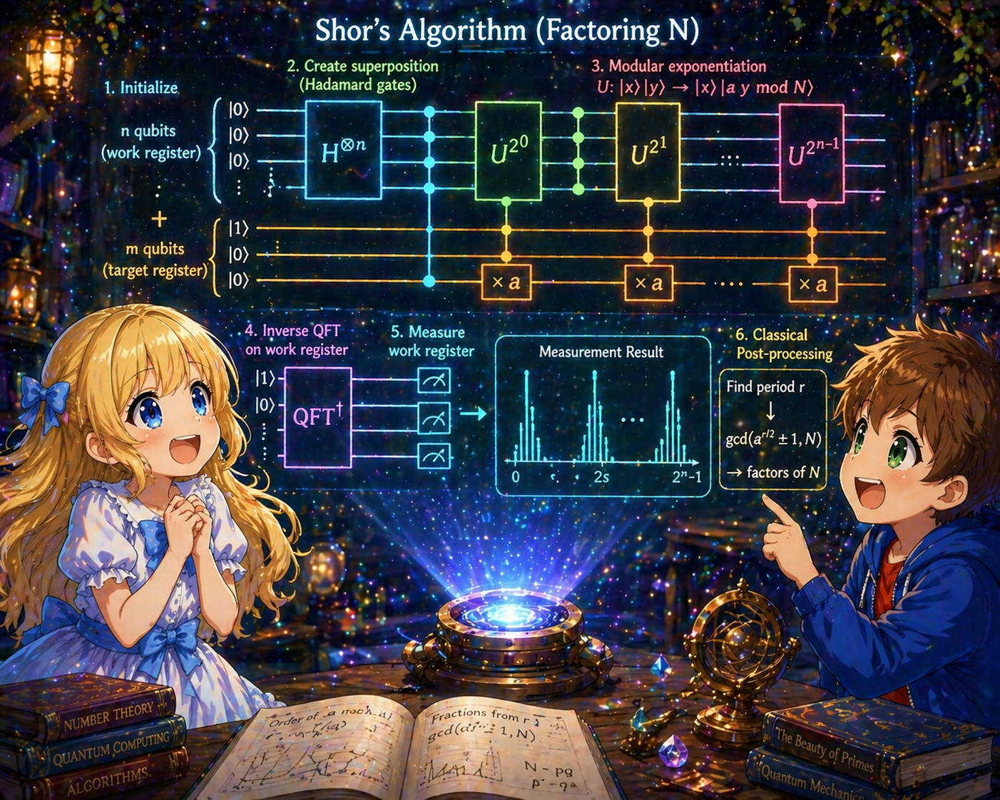
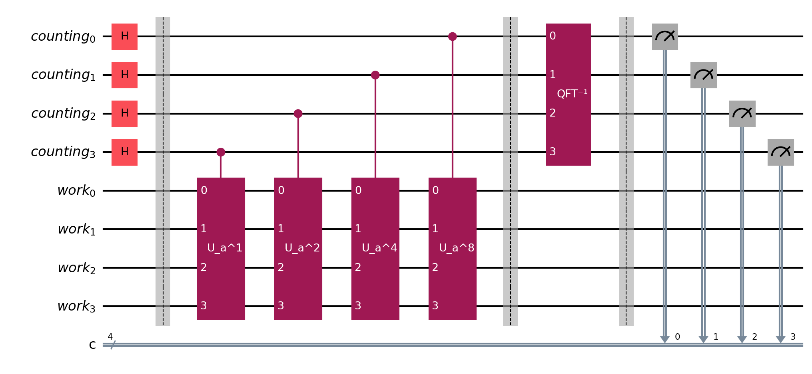

# 06: Shor's Algorithm

## What is Shor's Algorithm?

Shor's algorithm is a quantum algorithm that efficiently performs prime factorization of a composite number $N$. It was published by Peter Shor in 1994.

The best known general-purpose prime factorization algorithm on classical computers (the general number field sieve) requires sub-exponential time. In contrast, Shor's algorithm runs in polynomial time with respect to the number of bits in the input. This dramatic speedup directly affects the security of modern cryptography (such as RSA encryption).

### Overall Structure of the Algorithm

Shor's algorithm is a combination of a **classical part** and a **quantum part**:

1. **Classical part**: Reduce prime factorization to the "order finding problem"
2. **Quantum part**: Use Quantum Phase Estimation (Note 05) to find the order
3. **Classical part**: Compute the prime factors from the order

The quantum computer is responsible only for "order finding," and everything else is processed by the classical computer. Quantum computers do not surpass classical computers in all computations; there are problems they are good at and problems they are not. Shor's algorithm is a typical example: only the part that quantum computers excel at (order finding) is delegated to quantum, and the rest is handled by classical computers — the **collaboration** of both is the natural form.

---

## Number Theory Preliminaries

### Modular Arithmetic

$a \mod N$ represents the remainder when $a$ is divided by $N$. For example, $17 \mod 5 = 2$.

$a \equiv b \pmod{N}$ means "the remainders of $a$ and $b$ when divided by $N$ are equal."

### Greatest Common Divisor (GCD)

$\gcd(a, N)$ is the greatest common divisor of $a$ and $N$. When $\gcd(a, N) = 1$, $a$ and $N$ are said to be **coprime**.

The GCD can be efficiently computed using Euclid's algorithm, with computational complexity $O((\log N)^2)$ on classical computers.

### Order

When $\gcd(a, N) = 1$, the **order** $r$ of $a$ modulo $N$ is the smallest positive integer satisfying:

$$
a^r \equiv 1 \pmod{N}
$$

That is, when $a$ is multiplied by itself repeatedly, it eventually returns to 1 modulo $N$. The first such count is the order $r$.

**Example:** For $a = 7$, $N = 15$:

| $k$ | $7^k \mod 15$ |
|-----|---------------|
| 1 | $7$ |
| 2 | $49 \mod 15 = 4$ |
| 3 | $4 \times 7 \mod 15 = 28 \mod 15 = 13$ |
| 4 | $13 \times 7 \mod 15 = 91 \mod 15 = 1$ |

Since $7^4 \equiv 1 \pmod{15}$, $r = 4$.

---

## Reduction from Prime Factorization to Order Finding

The core of Shor's algorithm is that prime factorization can be reduced to order finding.

### The Reduction Mechanism

Suppose we want to factorize $N$. Randomly choose $a$ such that $\gcd(a, N) = 1$, and find the order $r$ of $a$.

If $r$ is even, the following holds:

$$
a^r - 1 \equiv 0 \pmod{N}
$$

Factoring $a^r - 1$:

$$
a^r - 1 = (a^{r/2} - 1)(a^{r/2} + 1)
$$

Therefore:

$$
(a^{r/2} - 1)(a^{r/2} + 1) \equiv 0 \pmod{N}
$$

This means that $N$ divides $(a^{r/2} - 1)(a^{r/2} + 1)$.

If $a^{r/2} \not\equiv \pm 1 \pmod{N}$, then at least one of $\gcd(a^{r/2} - 1, N)$ and $\gcd(a^{r/2} + 1, N)$ gives a non-trivial factor of $N$.

### Concrete Example: Factorization of $N = 15$

Choose $a = 7$. As computed above, the order is $r = 4$ (even).

$$
a^{r/2} = 7^2 = 49
$$

$$
a^{r/2} - 1 = 48, \quad a^{r/2} + 1 = 50
$$

$$
\gcd(48, 15) = 3, \quad \gcd(50, 15) = 5
$$

We obtain $15 = 3 \times 5$.

### Failure Cases

In the following cases, prime factors are not obtained:

**1. When $r$ is odd:** $r/2$ is not an integer, so the factorization $(a^{r/2} - 1)(a^{r/2} + 1)$ cannot be performed.

**2. When $a^{r/2} \equiv -1 \pmod{N}$:** Let us see in detail why this is a problem.

When $a^{r/2} \equiv -1 \pmod{N}$, the two factors are:

- $a^{r/2} + 1 \equiv -1 + 1 = 0 \pmod{N}$
- $a^{r/2} - 1 \equiv -1 - 1 = -2 \pmod{N}$

$a^{r/2} + 1 \equiv 0 \pmod{N}$ means that $N$ divides $a^{r/2} + 1$. Therefore $\gcd(a^{r/2} + 1, N) = N$, which only gives a trivial factor ($N$ itself).

What about $\gcd(a^{r/2} - 1, N)$? Since $a^r \equiv 1 \pmod{N}$ and $a^{r/2} \equiv -1 \pmod{N}$, we have $a^{r/2} - 1 \equiv -2 \pmod{N}$. Although $\gcd(-2, N) = \gcd(2, N)$, since $N$ is odd (the even case is handled in step 1), $\gcd(2, N) = 1$. This also gives only a trivial factor (1).

In other words, when $a^{r/2} \equiv -1 \pmod{N}$, the GCD only gives $N$ and $1$, neither of which is a non-trivial factor.

**What about $a^{r/2} \equiv 1 \pmod{N}$?** This cannot happen by the definition of order. The order $r$ is the **smallest** positive integer satisfying $a^r \equiv 1 \pmod{N}$. If $a^{r/2} \equiv 1 \pmod{N}$, then $r/2$ would be a smaller value satisfying $a^{r/2} \equiv 1$, contradicting the minimality of $r$.

In these cases, choose another $a$ and try again. It is known that the success probability is at least $1/2$, and after a few trials, prime factors are found with high probability.

---

## Complete Classical Procedure

Let us organize the entire flow of the algorithm.

**Input:** Composite number $N$ (which we want to factorize)

1. If $N$ is even, 2 is a factor. If $N$ is a prime power $p^k$, this can be detected classically. From here on, we assume $N$ is an odd composite number that is not a prime power.

2. Randomly choose $1 < a < N$.

3. Compute $\gcd(a, N)$. If $\gcd(a, N) > 1$, this is a factor of $N$ and we are done.

4. **(Quantum part)** Find the order $r$ of $a$ modulo $N$.

5. If $r$ is odd, return to step 2 and choose another $a$.

6. If $a^{r/2} \equiv -1 \pmod{N}$, return to step 2.

7. Compute $\gcd(a^{r/2} - 1, N)$ and $\gcd(a^{r/2} + 1, N)$. At least one of these is a non-trivial factor of $N$.

All steps except step 4 can be efficiently executed on a classical computer.

---

## Quantum Part: Order Finding

Let us organize the situation here. The goal is the prime factorization of a composite number $N$. To do this, we randomly choose $a$ such that $\gcd(a, N) = 1$, and find the order $r$ of $a$ (the smallest positive integer satisfying $a^r \equiv 1 \pmod{N}$).

To find $r$ on a classical computer, one would need to compute $a, a^2, a^3, \ldots$ in order and wait until they first return to 1, which is inefficient when $r$ is large. Hence we use Quantum Phase Estimation (Note 05).

To use QPE, we need a "unitary operator $U$ and its eigenvector $\vert u\rangle$." For order finding, we use the **modular multiplication** by $a$ as $U$.

### Definition of the Unitary Operator

$$
U_a\vert x\rangle = \vert ax \bmod N\rangle \qquad (0 \le x < N)
$$

Here $\vert x\rangle$ is the computational basis representing integers from $0$ to $N-1$. $U_a$ is the operation "replace the integer $x$ stored in the second register with $ax \bmod N$."

For example, when $a = 7$, $N = 15$, $U_7\vert 2\rangle = \vert 7 \times 2 \bmod 15\rangle = \vert 14\rangle$ and $U_7\vert 3\rangle = \vert 21 \bmod 15\rangle = \vert 6\rangle$.

It is known that when $\gcd(a, N) = 1$, $x \mapsto ax \bmod N$ becomes a bijection (a one-to-one mapping where different inputs always map to different outputs) on $\{0, 1, \ldots, N-1\}$. Since the inverse mapping also exists, $U_a$ is reversible and unitary.

### Why Modular Multiplication?

Let us see what happens when $U_a$ is repeatedly applied. Repeatedly applying $U_a$ to $\vert 1\rangle$:

$$
\vert 1\rangle \overset{ U_a }{\longrightarrow} \vert a \bmod N\rangle \overset{ U_a }{\longrightarrow} \vert a^2 \bmod N\rangle \overset{ U_a }{\longrightarrow} \cdots \overset{ U_a }{\longrightarrow} \vert a^{r-1} \bmod N\rangle \overset{ U_a }{\longrightarrow} \vert a^r \bmod N\rangle = \vert 1\rangle
$$

Since $a^r \equiv 1 \pmod{N}$, applying $r$ times returns to the original. That is, $U_a^r = I$ (identity operator), and $U_a$ is a cyclic operator with period $r$.

QPE (Note 05) is a "device that reads the phase $\varphi$ from the eigenvalue $e^{2\pi i\varphi}$ of a unitary operator $U$." As we will show later, the eigenvalues of $U_a$ have the form $e^{2\pi i \ell/r}$ ($\ell = 0, 1, \ldots, r-1$). Since the order $r$ appears in the denominator of the phase $\varphi = \ell/r$, we can measure $\ell/r$ with QPE and reverse-engineer $r$ from it.

### Implementation with Basic Gates

$U_a$ is not a basic gate like $H$ or CNOT, but rather a problem-specific composite circuit $\vert x\rangle \to \vert ax \bmod N\rangle$. The specific circuit construction (such as realizing multiplication by repeated modular addition) is beyond the scope of this note, but the two important points are:

- **$U_a$ can be implemented by combining basic gates (such as $H$, CNOT, Toffoli)**
- **Its gate count is $O(L^2)$ ($L = \lceil\log_2 N\rceil$ is the number of bits in $N$), which is bounded by a polynomial**

In this note, we treat $U_a\vert x\rangle = \vert ax \bmod N\rangle$ as a known operation. Readers interested in the details of the circuit construction should refer to Chapter 5 of Nielsen & Chuang, *Quantum Computation and Quantum Information* (Cambridge University Press).

### Eigenvectors and Eigenvalues of $U_a$

The eigenvectors of $U_a$ have the following form. They may seem to be given in an ad hoc manner, but we verify below that these are indeed eigenvectors:

$$
\vert u_\ell\rangle = \frac{1}{\sqrt{r}}\sum_{k=0}^{r-1} e^{-2\pi i \ell k/r}\vert a^k \bmod N\rangle \qquad (\ell = 0, 1, \ldots, r-1)
$$

> **Here $r$ is the order of $a$. The corresponding eigenvalue is $e^{2\pi i \ell/r}$.**

**Verification of the eigenvalue:**

$$
U_a\vert u_\ell\rangle = \frac{1}{\sqrt{r}}\sum_{k=0}^{r-1} e^{-2\pi i \ell k/r}\vert a^{k+1} \bmod N\rangle
$$

Substituting $k' = k + 1$, since $k = 0 \to k' = 1$ and $k = r-1 \to k' = r$, the range of summation becomes $k' = 1$ to $k' = r$:

$$
= \frac{1}{\sqrt{r}}\sum_{k'=1}^{r} e^{-2\pi i \ell(k'-1)/r}\vert a^{k'} \bmod N\rangle
$$

We want to return the range of summation to $k' = 0$ to $k' = r-1$. The values $\vert a^{k'} \bmod N\rangle$ in the sum cycle with period $r$: $a^r \equiv a^0$, $a^{r+1} \equiv a^1$, .... Similarly, the exponential factor $e^{-2\pi i \ell k'/r}$ also cycles with period $r$: $e^{-2\pi i \ell \cdot r/r} = e^{-2\pi i \ell} = 1 = e^{-2\pi i \ell \cdot 0/r}$. That is, each term in the sum is periodic in $k'$ with period $r$, and summing over any $r$ consecutive values of $k'$ gives the same result regardless of starting point. Therefore, we can replace the sum from $k' = 1$ to $r$ with a sum from $k' = 0$ to $r-1$:

$$
= \frac{1}{\sqrt{r}}\sum_{k'=0}^{r-1} e^{-2\pi i \ell(k'-1)/r}\vert a^{k'} \bmod N\rangle
$$

Separating the exponential factor as $e^{-2\pi i \ell(k'-1)/r} = e^{2\pi i \ell/r} \cdot e^{-2\pi i \ell k'/r}$, since $e^{2\pi i \ell/r}$ does not depend on $k'$, it can be factored out of the sum:

$$
= e^{2\pi i \ell/r} \cdot \frac{1}{\sqrt{r}}\sum_{k'=0}^{r-1} e^{-2\pi i \ell k'/r}\vert a^{k'} \bmod N\rangle = e^{2\pi i \ell/r}\vert u_\ell\rangle
$$

Therefore:

$$
U_a\vert u_\ell\rangle = e^{2\pi i \ell/r}\vert u_\ell\rangle
$$

Indeed, $\vert u_\ell\rangle$ is an eigenvector of $U_a$, with eigenvalue $e^{2\pi i \ell/r}$.

> **This is the heart of Shor's algorithm.** QPE can measure the phase $\varphi$ (Note 05). And now, the phase of the eigenvalue of the modular multiplication $U_a$ has the form $\varphi = \ell/r$, where the order $r$ we want to find appears in the denominator. In other words, **simply by reading off the phase with QPE, we obtain information about the order $r$**. This is the key that connects quantum phase estimation with order finding, and the reason we can obtain $r$ on a quantum computer when classical computers cannot do it efficiently.

### Obtaining the Order via QPE

Applying QPE to $U_a$ and $\vert u_\ell\rangle$ yields the phase $\varphi = \ell/r$ (see Note 05).

However, there is a contradiction here. The defining formula for the eigenvector $\vert u_\ell\rangle$ contains $r$, so to prepare $\vert u_\ell\rangle$, we must already know $r$. But $r$ is exactly what we want to find.

### Using $\vert 1\rangle$ as Input

In fact, we do not need to know $\vert u_\ell\rangle$. We can use a superposition of eigenvectors (see Note 05, "When the Eigenvector is Unknown").

The $\vert u_\ell\rangle$ form an orthonormal system, and the following relation holds:

$$
\frac{1}{\sqrt{r}}\sum_{\ell=0}^{r-1}\vert u_\ell\rangle = \frac{1}{r}\sum_{\ell=0}^{r-1}\sum_{k=0}^{r-1} e^{-2\pi i \ell k/r}\vert a^k \bmod N\rangle
$$

The $k = 0$ term is $\vert 1\rangle$ (since $a^0 = 1$), and using the orthogonality relation $\frac{1}{r}\sum_\ell e^{-2\pi i \ell k/r} = \delta_{k,0}$ (see Note 04):

$$
\frac{1}{\sqrt{r}}\sum_{\ell=0}^{r-1}\vert u_\ell\rangle = \vert 1\rangle
$$

That is, $\vert 1\rangle$ is the equal superposition of all eigenvectors of $U_a$.

$$
\vert 1\rangle = \frac{1}{\sqrt{r}}\sum_{\ell=0}^{r-1}\vert u_\ell\rangle = \frac{1}{\sqrt{r}}\Big(\vert u_0\rangle + \vert u_1\rangle + \cdots + \vert u_{r-1}\rangle\Big)
$$

Note, however, that $\vert 1\rangle$ itself is **not** an eigenvector of $U_a$. Applying $U_a$:

$$
U_a\vert 1\rangle = \vert a \cdot 1 \bmod N\rangle = \vert a\rangle \neq \vert 1\rangle
$$

For $a = 7, N = 15$, $\vert 1\rangle$ becomes $\vert 7\rangle$. Viewed as a superposition of eigenvectors:

$$
U_a\vert 1\rangle = U_a \frac{1}{\sqrt{r}}\sum_{\ell=0}^{r-1}\vert u_\ell\rangle = \frac{1}{\sqrt{r}}\sum_{\ell=0}^{r-1} e^{2\pi i \ell/r}\vert u_\ell\rangle
$$

Each $\vert u_\ell\rangle$ acquires a different phase $e^{2\pi i \ell/r}$, so the sum is no longer $\vert 1\rangle$. QPE works precisely because of this "different phase for each $\ell$," and the inverse QFT distinguishes the different phases to extract $\ell/r$.

### Quantum Circuit for Shor's Algorithm

With this knowledge, we now design the actual quantum circuit and identify $r$. Applying the QPE circuit construction (Note 05) to Shor's algorithm:

| Register | Qubits | Initial state | Role |
|---------|-----------|---------|------|
| First register (counting register) | $q_1, q_2, q_3, q_4$ ($n = 4$ bits) | $\vert 0\rangle^{\otimes n}$ | Stores the estimated value of phase $\ell/r$ |
| Second register | $q_5, q_6, q_7, q_8$ ($L = 4$ bits) | $\vert 1\rangle$ | Superposition of eigenvectors of $U_a$ |

Notations like $\vert j\rangle$ or $\vert 1\rangle$ refer to states where multiple qubits in a register together represent a single integer in binary (the same structure as $\vert s\rangle$ in Note 05). In each register, the first bit is the most significant bit (MSB). For example, in the counting register, $\vert 5\rangle$ means $q_1 = 0$, $q_2 = 1$, $q_3 = 0$, $q_4 = 1$ (binary 0101), and $\vert 1\rangle = \vert 0001\rangle$ in the second register means $q_5 = 0$, $q_6 = 0$, $q_7 = 0$, $q_8 = 1$. The MSB of the counting register $q_1$ controls the largest power $U_a^{2^{n-1}}$.

Also, the eigenvectors $\vert u_\ell\rangle$ from the previous section are also states of the entire second register (all 4 qubits), not specific single qubits. $\ell$ is not the value of the second register but a label distinguishing the $r$ eigenvectors ($\ell = 0, 1, \ldots, r-1$). For $a = 7, N = 15$, $r = 4$, so there are 4 eigenvectors $\ell \in \{0, 1, 2, 3\}$. What is noteworthy here is that even though $r$ is currently unknown, simply by inputting $\vert 1\rangle$, the superposition of $r$ eigenvectors $\vert u_\ell\rangle$ is automatically realized (see the previous section's $\frac{1}{\sqrt{r}}\sum_{\ell}\vert u_\ell\rangle = \vert 1\rangle$). This technique works because we can prepare the correct input without knowing $r$.

> **Note:** In the text, qubits are described starting from 1, but in the circuit diagram they are displayed starting from 0 ($q_0, q_1, \ldots$). The counting register corresponds to $q_0$ to $q_3$, and the second register to $q_4$ to $q_7$.

We show the QPE procedure with the state at each step. The initial state is $\vert 0\rangle^{\otimes n} \otimes \vert 1\rangle$.

**Step 1.** Apply $H^{\otimes n}$ to the first register:

$$
\vert 0\rangle^{\otimes n} \otimes \vert 1\rangle \overset{ H^{\otimes n} \otimes I }{\longrightarrow} \frac{1}{\sqrt{2^n}}\sum_{j=0}^{2^n-1}\vert j\rangle \otimes \vert 1\rangle
$$

The first register is now in an equal superposition of all computational basis states. The second register is unchanged.

**Step 2.** Using the $k$-th bit of the first register ($k = 1, 2, \ldots, n$) as the control bit, apply $U_a^{2^{n-k}}$ to the second register. $k = 1$ (MSB) controls the largest $U_a^{2^{n-1}}$, and $k = n$ (LSB) controls the smallest $U_a^{1}$. By phase kickback (see Note 05), the phase is transferred to the first register:

If the second register were a single eigenvector $\vert u_\ell\rangle$ of $U_a$, let us see what happens.

Since $U_a\vert u_\ell\rangle = e^{2\pi i \ell/r}\vert u_\ell\rangle$, applying $U_a$ $2^{n-k}$ times:

$$
U_a^{2^{n-k}}\vert u_\ell\rangle = \left(e^{2\pi i \ell/r}\right)^{2^{n-k}}\vert u_\ell\rangle = e^{2\pi i \cdot 2^{n-k} \ell/r}\vert u_\ell\rangle
$$

The eigenvector $\vert u_\ell\rangle$ is unchanged, and the eigenvalue is raised to the $2^{n-k}$-th power. When applied as a controlled gate, by phase kickback (see Note 05), this eigenvalue is transferred to the $k$-th bit of the first register.

When the phase kickbacks from all bits $k = 1, \ldots, n$ are combined, the state $\vert j\rangle$ of the first register (where the binary representation of $j$ determines the values of each bit) acquires the phase $e^{2\pi i j \ell/r}$ (for details of this mechanism, see Step 2: Controlled Unitary Operations in Note 05). As a result:

$$
\overset{ \text{controlled } U_a^{2^{n-k}} }{\longrightarrow} \frac{1}{\sqrt{2^n}}\sum_{j=0}^{2^n-1} e^{2\pi i j \ell/r}\vert j\rangle \otimes \vert u_\ell\rangle
$$

However, the actual second register is $\vert 1\rangle$. As shown in the section "Using $\vert 1\rangle$ as Input" above, $\vert 1\rangle = \frac{1}{\sqrt{r}}\sum_\ell \vert u_\ell\rangle$, which is a superposition of $r$ eigenvectors. Since QPE is a linear operation, the above transformation is performed independently on each eigenvector. Therefore, the overall state is:

$$
\overset{ \text{controlled } U_a^{2^{n-k}} }{\longrightarrow} \frac{1}{\sqrt{r}}\sum_{\ell=0}^{r-1}\left(\frac{1}{\sqrt{2^n}}\sum_{j=0}^{2^n-1} e^{2\pi i j \ell/r}\vert j\rangle\right) \otimes \vert u_\ell\rangle
$$

A different phase $\ell/r$ has been transferred to the first register for each eigenvector.

**Step 3.** Apply the inverse QFT ($F_{2^n}^\dagger$) to the first register. After Step 2, the state of the first register corresponding to the eigenvector $\vert u_\ell\rangle$ is $\frac{1}{\sqrt{2^n}}\sum_j e^{2\pi i j \ell/r}\vert j\rangle$. As shown in Note 05, this state has the form $F_{2^n}\vert s\rangle$. Therefore, applying the inverse QFT gives, by $F_{2^n}^\dagger F_{2^n} = I$:

$$
F_{2^n}^\dagger \left(\frac{1}{\sqrt{2^n}}\sum_{j=0}^{2^n-1} e^{2\pi i j \ell/r}\vert j\rangle\right) = F_{2^n}^\dagger F_{2^n}\vert s\rangle = \vert s\rangle
$$

$s$ is the integer obtained from $0$ to $2^n - 1$ when the first register is measured (see the summary of Note 05). Here $\varphi = \ell/r$, so:

$$
s = 2^n \times \frac{\ell}{r}
$$

When $\ell/r$ cannot be exactly represented with $n$ bits, the value closest to $\ell/r$ is obtained with the highest probability.

The inverse QFT does not act on the second register, so $\vert u_\ell\rangle$ remains unchanged. The overall state is:

$$
\overset{ F_{2^n}^\dagger \otimes I }{\longrightarrow} \vert s\rangle_{\text{1st}} \otimes \vert u_\ell\rangle_{\text{2nd}}
$$

**Step 4.** Measure the first register in the computational basis to obtain the integer $s$.

"After QPE" refers to the state after executing Steps 1-3, just before the measurement in Step 4.

As shown in Note 05's "When the Eigenvector is Unknown," when a superposition of eigenvectors is input to QPE, QPE performs phase estimation independently on each eigenvector. Since $\vert 1\rangle = \frac{1}{\sqrt{r}}\sum_\ell \vert u_\ell\rangle$, the state after QPE is:

$$
\frac{1}{\sqrt{r}}\sum_{\ell=0}^{r-1} \vert s\rangle_{\text{1st}} \otimes \vert u_\ell\rangle_{\text{2nd}}
$$

This expression is a superposition of $r$ terms. Each term consists of a pair of first and second registers, and **both registers differ** for each value of $\ell$:

| $\ell$ | First register $\vert s\rangle$ | Second register $\vert u_\ell\rangle$ |
|-----|---|----|
| $0$ | $s = 0$ | $\vert u_0\rangle$ |
| $1$ | $s = 2^n \cdot 1/r$ | $\vert u_1\rangle$ |
| $2$ | $s = 2^n \cdot 2/r$ | $\vert u_2\rangle$ |
| $\vdots$ | $\vdots$ | $\vdots$ |
| $r-1$ | $s = 2^n \cdot (r-1)/r$ | $\vert u_{r-1}\rangle$ |

The $s$ in the first register takes different values for each $\ell$ ($s = 2^n \cdot s/r$).

When measured, one of the $r$ terms is randomly selected with probability $\lvert 1/\sqrt{r}\rvert^2 = 1/r$. Although the observer does not know which $\ell$ was selected, the integer $s$ is obtained as the measurement result.

Let us organize the situation here:

- What is obtained by measurement: integer $s$ (known)
- The number of bits of the counting register $2^n$ (known)
- Therefore, $s/2^n$ can be computed (known)
- This is an approximation of $\ell/r$: $s/2^n \approx s/r$
- What we want to find is the denominator $r$ (unknown). $\ell$ is also unknown

We have obtained the rational number $s/2^n$, but both $\ell$ and $r$ are unknown. At first glance, there is one equation and two unknowns, so it appears unsolvable. However, using the constraint $r < N$ and the condition that $s/r$ is an irreducible fraction ($s$ and $r$ are coprime), in many cases we can uniquely recover $\ell/r$ from $s/2^n$ via **continued fraction expansion**. The denominator of the recovered fraction becomes the candidate for $r$.

Once we have a candidate for $r$, we verify on a classical computer whether $a^r \bmod N = 1$ actually holds.

---

## Determining the Order from Measurement Results: Continued Fraction Expansion

### Problem

The QPE measurement result is the integer $s$, and the estimated phase is $s/2^n$. This is an approximation of $\ell/r$:

$$
\frac{s}{2^n} \approx \frac{\ell}{r}
$$

We want to find the order $r$ from this. $s$ and $2^n$ are known, but $\ell$ and $r$ are unknown.

### Continued Fraction Expansion

By computing the **continued fraction expansion** of $s/2^n$, we can recover $\ell/r$ with high probability.

The continued fraction expansion of a rational number $x$ is the representation in the following form:

$$
x = a_0 + \cfrac{1}{a_1 + \cfrac{1}{a_2 + \cfrac{1}{\ddots}}}
$$

This is abbreviated as $[a_0; a_1, a_2, \ldots]$.

The values obtained by truncating the expansion (the **convergents**) $p_k/q_k$ give the "best rational approximations" of $x$.

By a theorem in number theory, when $s/2^n$ is sufficiently close to $\ell/r$, the irreducible fraction $\ell/r$ is guaranteed to appear among the convergents of the continued fraction expansion of $s/2^n$. Therefore, the denominators $q_k$ of the convergents are candidates for the order $r$ (or its divisors).

### Concrete Example: $N = 15$, $a = 7$

Suppose we use a $n = 4$ bit counting register. $2^n = 16$.

The order is $r = 4$ (this is the value we want to find, but we show it here in advance for verification. Note that for the observer of the quantum circuit, $r$ is an unknown value). Executing the QPE circuit and measuring the first register yields an integer $s$. $s/16$ becomes the estimated value of the phase $\ell/r = \ell/4$.

In the operation of the quantum circuit, one of $\ell = 0, 1, 2, 3$ is selected with equal probability $1/4$. For example, if $\ell = 1$ is selected, then $\varphi = 1/4$, and since $1/4$ can be exactly represented with $n = 4$ bits, $s = 2^n \cdot \ell/r = 16 \cdot 1/4 = 4$ is measured deterministically. However, from the observer's standpoint, all that is obtained is the integer "4," and it is not directly known whether this came out deterministically or whether $r = 4$. The observer then reverse-engineers $r$ from this result of "4" through the following procedure.

For each $\ell$, we trace the process of finding the order $r$ from the measurement result $s$.

Let us confirm the notation for continued fraction expansion. For a rational number $x = [a_0; a_1, a_2, \ldots]$, the **convergents** are values obtained by truncating the continued fraction, written as $p_k/q_k$. $p_k$ is the numerator and $q_k$ is the denominator. The candidates for the order are obtained from the **denominators** $q_k$ of the convergents (if $\ell/r$ is an irreducible fraction, there exists a convergent with $q_k = r$).

**When measurement result $s = 4$ is obtained (internally corresponds to $\ell = 1$):**

$$
\frac{\ell}{r} = \frac{s}{2^n} = \frac{4}{16} = \frac{1}{4}
$$

The continued fraction expansion of $1/4$ is $[0; 4]$ ($0 + 1/4$). Computing the convergents in order:

- 0th convergent: $a_0 = 0$ → $p_0/q_0 = 0/1$
- 1st convergent: $a_0 + 1/a_1 = 0 + 1/4 = 1/4$ → $p_1/q_1 = 1/4$

The denominator $q_1 = 4$ is the candidate for the order. Verifying, $7^4 \bmod 15 = 2401 \bmod 15 = 1$, so indeed $r = 4$ is the order.

**When measurement result $s = 8$ is obtained (internally corresponds to $\ell = 2$):**

$$
\frac{\ell}{r} = \frac{s}{2^n} = \frac{8}{16} = \frac{1}{2}
$$

The continued fraction expansion is $[0; 2]$. The convergents are:

- $p_0/q_0 = 0/1$
- $p_1/q_1 = 1/2$

The denominator $q_1 = 2$ is the candidate for the order. Verifying, $7^2 \bmod 15 = 49 \bmod 15 = 4 \neq 1$, so $r = 2$ is not the order. This is because $\ell = 2$ and $r = 4$ have a common factor of 2, so $\ell/r = 2/4 = 1/2$ is reduced, and $r = 4$ is no longer directly visible from the denominator. In this case, we try small multiples of $q_1$. Verifying $2 \times q_1 = 4$, $7^4 \bmod 15 = 1$, so $r = 4$ is found.

**When measurement result $s = 12$ is obtained (internally corresponds to $\ell = 3$):**

$$
\frac{\ell}{r} = \frac{s}{2^n} = \frac{12}{16} = \frac{3}{4}
$$

The continued fraction expansion is $[0; 1, 3]$ ($0 + 1/(1 + 1/3) = 1/(4/3) = 3/4$). The convergents are:

- $p_0/q_0 = 0/1$
- $p_1/q_1 = 1/1$
- $p_2/q_2 = 3/4$

The denominator $q_2 = 4$ is the candidate for the order. Verifying, $7^4 \bmod 15 = 1$, so $r = 4$.

**When measurement result $s = 0$ is obtained (internally corresponds to $\ell = 0$):**

$s/2^n = 0/16 = 0$, and the continued fraction expansion does not give information about the denominator, so the order cannot be determined. In this case, the algorithm is restarted.

### Algorithm for Continued Fraction Expansion

The continued fraction expansion of $x = p/q$ (irreducible fraction) is computed by the following procedure:

1. $a_0 = \lfloor x \rfloor$ (the integer part of $x$)
2. $x_1 = 1/(x - a_0)$
3. $a_1 = \lfloor x_1 \rfloor$
4. Repeat. Stop when $x_k$ becomes an integer.

**Example:** $x = 12/16 = 3/4$

$$
a_0 = \lfloor 3/4 \rfloor = 0, \quad x_1 = \frac{1}{3/4} = \frac{4}{3}
$$

$$
a_1 = \lfloor 4/3 \rfloor = 1, \quad x_2 = \frac{1}{4/3 - 1} = \frac{1}{1/3} = 3
$$

$$
a_2 = 3 \quad \text{(integer, so stop)}
$$

The continued fraction notation is $[0; 1, 3]$, and the convergents are:

$$
\frac{p_0}{q_0} = \frac{0}{1}, \quad \frac{p_1}{q_1} = \frac{1}{1}, \quad \frac{p_2}{q_2} = \frac{3}{4}
$$

---

## Quantum Circuit for Modular Exponentiation

The controlled $U_a^{2^k}$ required for QPE is a circuit that performs the controlled modular exponentiation $\vert x\rangle \to \vert a^{2^k} x \bmod N\rangle$.

### Circuit Overview

The modular multiplication $x \mapsto bx \bmod N$ ($b = a^{2^k} \bmod N$) can be decomposed as follows:

1. Construct modular multiplication by repeating **modular addition**
2. Modular addition is further decomposed into basic addition and comparison circuits

### Computational Complexity

Let $L = \lceil \log_2 N \rceil$ (the number of bits in $N$).

- Gate count for one modular multiplication: $O(L^2)$
- Number of modular multiplications needed for QPE: $n$ ($U^{2^0}, U^{2^1}, \ldots, U^{2^{n-1}}$)
- With $n \approx 2L$, the total gate count: $O(L^3)$

Combined with the inverse QFT gate count $O(n^2) = O(L^2)$, the total quantum circuit gate count for Shor's algorithm is $O(L^3)$. This is polynomial in the number of bits in $N$, asymptotically faster than the best classical algorithm (the general number field sieve, sub-exponential time).

---

## Comparison of Computational Complexity

| Algorithm | Complexity | Type |
|---|---|---|
| Trial division | $O(\sqrt{N})$ | Classical, exponential time |
| General number field sieve | $O\!\left(e^{c(\ln N)^{1/3}(\ln\ln N)^{2/3}}\right)$ | Classical, sub-exponential time |
| Shor's algorithm | $O(L^3)$ ($L = \log N$) | Quantum, polynomial time |

"Exponential time" and "polynomial time" are classifications with respect to the number of bits $L = \log_2 N$ in $N$. Trial division is $O(\sqrt{N}) = O(2^{L/2})$, which is exponential in $L$.

---

## Summary

| Concept | Content |
|------|------|
| Goal | Prime factorization of composite number $N$ |
| Core reduction | Prime factorization → order finding → quantum phase estimation |
| Input to quantum part | $U_a\vert x\rangle = \vert ax \bmod N\rangle$, second register $= \vert 1\rangle$ |
| Output of quantum part | Approximation $s/2^n$ of $\ell/r$ |
| Order recovery | Find $r$ from $s/2^n$ via continued fraction expansion |
| Computing prime factors | $\gcd(a^{r/2} \pm 1, N)$ |
| Success probability | $\ge 1/2$ per trial. High probability after a few trials |
| Computational complexity | $O(L^3)$ ($L = \log_2 N$) — polynomial time |
| Quantum subroutines used | QPE (Note 05), inverse QFT (Note 04) |
| Classical subroutines used | Euclid's algorithm, continued fraction expansion, modular exponentiation |
