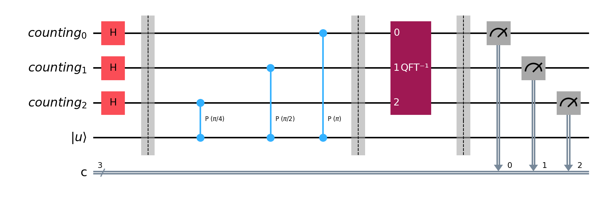
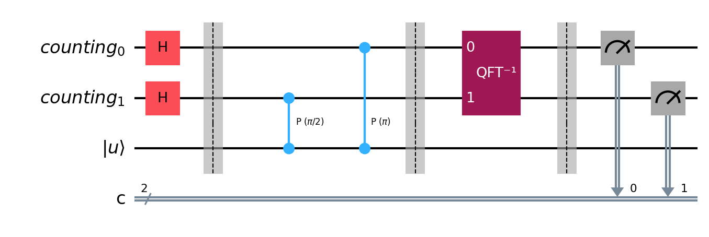

# 05: 量子位相推定（Quantum Phase Estimation）

## なぜ位相推定を学ぶのか

量子位相推定（QPE）は、量子コンピュータの最も重要なサブルーチンの一つである。Shor の素因数分解アルゴリズム、量子化学シミュレーション、その他多くの量子アルゴリズムが QPE を内部で使用している。

QPE の本質は「ユニタリ演算子の固有値を量子回路で読み取る」ことであり、量子フーリエ変換（ノート04）の直接的な応用である。

---

## 問題設定

### 固有値と固有ベクトル

ユニタリ演算子 $U$ とその固有ベクトル $\vert u\rangle$ が与えられているとする：

$$
U\vert u\rangle = e^{2\pi i \varphi}\vert u\rangle
$$

ここで $e^{2\pi i \varphi}$ は固有値であり、 $\varphi$ は $0 \le \varphi < 1$ の実数である。

ユニタリ演算子の固有値は必ず絶対値 1 の複素数（ $\vert e^{2\pi i \varphi}\vert = 1$）なので、すべての情報は位相 $\varphi$ に含まれている。

### 目標

**$U$ と $\vert u\rangle$ が与えられたとき、位相 $\varphi$ を推定せよ。**

具体的には、 $\varphi$ の $n$ ビットの近似 $\tilde{\varphi}$ を求める。 $n$ ビットの精度とは $\tilde{\varphi} = 0.j_1 j_2 \cdots j_n$（2進小数）の意味であり、誤差は高い確率で $\lvert\varphi - \tilde{\varphi}\rvert \le 2^{-n}$ 程度となる（計数レジスタのビット数を増やすことで成功確率を上げられる）。

### 2進小数の表記

2進小数 $0.j_1 j_2 \cdots j_n$ は次の値を表す：

$$
0.j_1 j_2 \cdots j_n = \frac{j_1}{2} + \frac{j_2}{4} + \cdots + \frac{j_n}{2^n} = \sum_{k=1}^{n} \frac{j_k}{2^k}
$$

ここで各 $j_k \in \{0, 1\}$ である。

**例：** $0.101_2 = \frac{1}{2} + \frac{0}{4} + \frac{1}{8} = \frac{5}{8} = 0.625$

---

## QPE の回路構成

### レジスタ

QPE 回路は2つのレジスタからなる：

| レジスタ | 量子ビット数 | 初期状態 | 役割 |
|---------|------------|---------|------|
| 第1レジスタ（計数レジスタ） | $n$ | $\vert 0\rangle^{\otimes n}$ | 位相 $\varphi$ の推定値を格納する |
| 第2レジスタ（固有状態レジスタ） | $m$ | $\vert u\rangle$ | $U$ の固有ベクトル |

$m$ は $U$ が作用する空間の量子ビット数であり、問題に依存する。

### 回路の概要

QPE の回路は4つのステップからなる：

1. **アダマール変換**: 第1レジスタの全量子ビットに $H$ を適用
2. **制御ユニタリ演算**: 第1レジスタの各ビットを制御ビットとして $U^{2^k}$ を第2レジスタに適用
3. **逆量子フーリエ変換**: 第1レジスタに $\text{QFT}^{-1}$ を適用
4. **測定**: 第1レジスタを計算基底で測定

---

## 制御ユニタリゲート

### 定義

$n$ 量子ビットのユニタリ演算子 $U$ に対して、**制御 $U$ ゲート**（$\text{controlled-}U$）は次のように動作する：

$$
CU\vert 0\rangle\vert\psi\rangle = \vert 0\rangle\vert\psi\rangle, \quad CU\vert 1\rangle\vert\psi\rangle = \vert 1\rangle(U\vert\psi\rangle)
$$

制御ビットが $\vert 0\rangle$ なら何もせず、 $\vert 1\rangle$ なら $U$ を適用する。CNOT は $U = X$ の特殊な場合である（ノート02参照）。

### 固有ベクトルに対する制御 $U$ の作用

$U\vert u\rangle = e^{2\pi i \varphi}\vert u\rangle$ のとき、制御 $U$ の作用は：

$$
CU\vert 0\rangle\vert u\rangle = \vert 0\rangle\vert u\rangle
$$

$$
CU\vert 1\rangle\vert u\rangle = \vert 1\rangle(U\vert u\rangle) = e^{2\pi i \varphi}\vert 1\rangle\vert u\rangle
$$

これを一般の重ね合わせ状態に適用すると：

$$
CU\left(\frac{\vert 0\rangle + \vert 1\rangle}{\sqrt{2}}\right)\vert u\rangle = \frac{\vert 0\rangle + e^{2\pi i \varphi}\vert 1\rangle}{\sqrt{2}}\vert u\rangle
$$

固有ベクトル $\vert u\rangle$ は変化せず、位相 $e^{2\pi i \varphi}$ が **制御ビットに転写される**。これを **位相キックバック** と呼ぶ。QPE はこの現象を基盤としている。

### 位相キックバックの導出

上の式を丁寧に導出する。制御ビットが $\frac{\vert 0\rangle + \vert 1\rangle}{\sqrt{2}}$ のとき：

$$
CU\left(\frac{\vert 0\rangle + \vert 1\rangle}{\sqrt{2}}\right)\vert u\rangle = \frac{1}{\sqrt{2}}\Big(CU\vert 0\rangle\vert u\rangle + CU\vert 1\rangle\vert u\rangle\Big)
$$

第1項は $\vert 0\rangle\vert u\rangle$、第2項は $e^{2\pi i \varphi}\vert 1\rangle\vert u\rangle$ なので：

$$
= \frac{1}{\sqrt{2}}\Big(\vert 0\rangle\vert u\rangle + e^{2\pi i \varphi}\vert 1\rangle\vert u\rangle\Big) = \frac{\vert 0\rangle + e^{2\pi i \varphi}\vert 1\rangle}{\sqrt{2}} \otimes \vert u\rangle
$$

$\vert u\rangle$ が因子として分離しており、位相 $e^{2\pi i\varphi}$ は制御ビットの $\vert 1\rangle$ 成分にだけ掛かっている。

### $U$ の繰り返し適用

$U^{2^k}\vert u\rangle = e^{2\pi i \cdot 2^k \varphi}\vert u\rangle$ なので、制御 $U^{2^k}$ に対しても同様に：

$$
CU^{2^k}\left(\frac{\vert 0\rangle + \vert 1\rangle}{\sqrt{2}}\right)\vert u\rangle = \frac{\vert 0\rangle + e^{2\pi i \cdot 2^k \varphi}\vert 1\rangle}{\sqrt{2}}\vert u\rangle
$$

制御ビットに転写される位相が $2^k$ 倍になる。

---

## QPE の動作（数学的導出）

$n$ ビットの計数レジスタで位相推定を行う。量子ビットを $q_1, q_2, \ldots, q_n$（第1レジスタ）と $\vert u\rangle$（第2レジスタ）とする。

### ステップ 1: アダマール変換

第1レジスタの全量子ビットに $H$ を適用する。初期状態は $\vert 0\rangle^{\otimes n}\vert u\rangle$ である：

$$
H^{\otimes n}\vert 0\rangle^{\otimes n} = (H\vert 0\rangle) \otimes (H\vert 0\rangle) \otimes \cdots \otimes (H\vert 0\rangle) = \frac{\vert 0\rangle + \vert 1\rangle}{\sqrt{2}} \otimes \frac{\vert 0\rangle + \vert 1\rangle}{\sqrt{2}} \otimes \cdots \otimes \frac{\vert 0\rangle + \vert 1\rangle}{\sqrt{2}}
$$

$$
= \left(\frac{\vert 0\rangle + \vert 1\rangle}{\sqrt{2}}\right)^{\otimes n} = \frac{1}{\sqrt{2^n}}\sum_{j=0}^{2^n - 1}\vert j\rangle
$$

ステップ1の後の状態：

$$
\vert\Psi_1\rangle = \frac{1}{\sqrt{2^n}}\sum_{j=0}^{2^n - 1}\vert j\rangle \otimes \vert u\rangle
$$

### ステップ 2: 制御ユニタリ演算

第1レジスタの $q_k$（ $k = 1, 2, \ldots, n$）を制御ビットとして、 $U^{2^{n-k}}$ を第2レジスタに適用する。

まず $n = 1$（計数レジスタが1ビット）の場合を考える：

$$
\frac{\vert 0\rangle + \vert 1\rangle}{\sqrt{2}}\vert u\rangle \overset{ CU }{\longrightarrow} \frac{\vert 0\rangle + e^{2\pi i \varphi}\vert 1\rangle}{\sqrt{2}}\vert u\rangle
$$

$n = 2$ の場合、 $q_1$ で $U^2$ を、 $q_2$ で $U^1$ を制御する：

$$
\frac{\vert 0\rangle + \vert 1\rangle}{\sqrt{2}} \otimes \frac{\vert 0\rangle + \vert 1\rangle}{\sqrt{2}} \otimes \vert u\rangle
\quad \overset{ CU^2,  CU }{\longrightarrow}  \quad
\frac{\vert 0\rangle + e^{2\pi i \cdot 2\varphi}\vert 1\rangle}{\sqrt{2}} \otimes \frac{\vert 0\rangle + e^{2\pi i \varphi}\vert 1\rangle}{\sqrt{2}} \otimes \vert u\rangle
$$

一般の $n$ ビットの場合：

$$
\vert\Psi_2\rangle = \frac{1}{\sqrt{2^n}}\bigotimes_{k=1}^{n}\Big(\vert 0\rangle + e^{2\pi i \cdot 2^{n-k}\varphi}\vert 1\rangle\Big) \otimes \vert u\rangle
$$

$k = 1, 2, \ldots, n$ を展開して書くと：

$$
\vert\Psi_2\rangle = \frac{1}{\sqrt{2^n}}\Big(\vert 0\rangle + e^{2\pi i \cdot 2^{n-1}\varphi}\vert 1\rangle\Big) \otimes \Big(\vert 0\rangle + e^{2\pi i \cdot 2^{n-2}\varphi}\vert 1\rangle\Big) \otimes \cdots \otimes \Big(\vert 0\rangle + e^{2\pi i \cdot 2^0 \varphi}\vert 1\rangle\Big) \otimes \vert u\rangle
$$

$q_1$ には位相 $2^{n-1}\varphi$（最大）、 $q_n$ には位相 $2^0\varphi = \varphi$（最小）が掛かっている。上位ビットほど大きな位相キックバックを受ける。

### テンソル積の展開

上の式が $e^{2\pi i j\varphi}$ の形にまとまることを確認する。

各因子 $(\vert 0\rangle + e^{2\pi i \cdot 2^{n-k}\varphi}\vert 1\rangle)$ を $j_k \in \{0, 1\}$ で展開すると、 $j_k = 0$ の項は $\vert 0\rangle$（位相なし）、 $j_k = 1$ の項は $e^{2\pi i \cdot 2^{n-k}\varphi}\vert 1\rangle$ である。つまり各因子は $\sum_{j_k=0}^{1} e^{2\pi i \cdot j_k \cdot 2^{n-k}\varphi}\vert j_k\rangle$ と書ける（ $j_k = 0$ のとき $e^0 = 1$）。

$n$ 個の因子のテンソル積を展開すると、 $j_1, j_2, \ldots, j_n$ のすべての組み合わせについて和を取ることになる：

$$
\frac{1}{\sqrt{2^n}}\sum_{j_1=0}^{1}\sum_{j_2=0}^{1}\cdots\sum_{j_n=0}^{1} e^{2\pi i(j_1 \cdot 2^{n-1} + j_2 \cdot 2^{n-2} + \cdots + j_n \cdot 2^0)\varphi}\vert j_1 j_2 \cdots j_n\rangle \otimes \vert u\rangle
$$

ここで指数部分の $j_1 \cdot 2^{n-1} + j_2 \cdot 2^{n-2} + \cdots + j_n \cdot 2^0$ は、 $j_1 j_2 \cdots j_n$ を2進数として読んだときの10進数の値そのものである。これを $j$ と書けば：

$$
\vert\Psi_2\rangle = \frac{1}{\sqrt{2^n}}\sum_{j=0}^{2^n - 1} e^{2\pi i j\varphi}\vert j\rangle \otimes \vert u\rangle
$$

各ビットに掛かる位相 $2^{n-k}\varphi$ が、2進数の桁の重み $2^{n-k}$ と対応しているからこそ、テンソル積が $e^{2\pi i j\varphi}$ という単一の指数にまとまる。

**展開の確認（ $n = 2$ の場合）：**

$j$ の2進数表現を $j = j_1 \cdot 2 + j_2$（ $j_1, j_2 \in \{0,1\}$）と書くと：

$$
\frac{1}{2}\sum_{j_1, j_2} e^{2\pi i (j_1 \cdot 2 + j_2)\varphi}\vert j_1 j_2\rangle = \frac{1}{2}\sum_{j_1, j_2} e^{2\pi i \cdot 2j_1 \varphi} e^{2\pi i j_2 \varphi}\vert j_1\rangle\vert j_2\rangle
$$

$$
= \frac{1}{2}\left(\sum_{j_1} e^{2\pi i \cdot 2j_1\varphi}\vert j_1\rangle\right)\left(\sum_{j_2} e^{2\pi i j_2\varphi}\vert j_2\rangle\right) = \frac{\vert 0\rangle + e^{2\pi i \cdot 2\varphi}\vert 1\rangle}{\sqrt{2}} \otimes \frac{\vert 0\rangle + e^{2\pi i\varphi}\vert 1\rangle}{\sqrt{2}}
$$

テンソル積の形と確かに一致する。

### ステップ 3: 逆量子フーリエ変換

ステップ2の後の第1レジスタの状態（ $\vert u\rangle$ を省略）は：

$$
\frac{1}{\sqrt{N}}\sum_{j=0}^{N - 1} e^{2\pi i j\varphi}\vert j\rangle \qquad (N = 2^n)
$$

ノート04で定義した DFT の順変換を思い出す。入力列 $x_0, \ldots, x_{N-1}$ の DFT は：

$$
X_k = \frac{1}{\sqrt{N}}\sum_{j=0}^{N-1} x_j  \omega_N^{jk}, \qquad \omega_N = e^{2\pi i / N}
$$

量子状態の言葉では、 $\vert x\rangle = \sum_j x_j \vert j\rangle$ に対して $F_N\vert x\rangle = \sum_k X_k \vert k\rangle$ である。

いま、もし $\varphi = s/N$（ $s$ は整数、 $0 \le s < N$）であれば、 $e^{2\pi i j\varphi} = e^{2\pi i js/N}$ と書ける。ここで $\omega_N = e^{2\pi i/N}$ を思い出すと $e^{2\pi i js/N} = \omega_N^{js}$ なので：

$$
\frac{1}{\sqrt{N}}\sum_{j=0}^{N-1} e^{2\pi i j\varphi}\vert j\rangle = \frac{1}{\sqrt{N}}\sum_{j=0}^{N-1} \omega_N^{js}\vert j\rangle
$$

一方、 $F_N\vert s\rangle$ がどのような状態になるかを、DFT 行列の定義から直接計算してみる。

行列 $F_N$ をベクトル $\vert s\rangle$ に掛けるとは、出力の第 $k$ 成分を $\sum_j (F_N)_{kj} (\vert s\rangle)_j$ で計算することである。 $\vert s\rangle$ は $N$ 次元のベクトルだが、 $N = 2^n$ なので $n = \log_2 N$ 本の量子ビットで表現できる。例えば $N = 4$ なら $\vert s\rangle$ は 4 次元ベクトルだが、回路上は 2 本の量子ビットで済む。 $\vert s\rangle$ は計算基底なので第 $s$ 成分だけが 1、他はすべて 0 である：

$$
\vert s\rangle = \begin{pmatrix} 0 \\\\ \vdots \\\\ 0 \\\\ 1 \\\\ 0 \\\\ \vdots \\\\ 0 \end{pmatrix} \leftarrow s\ 番目
$$

したがって行列 $F_N$ をこのベクトルに掛けると、 $F_N$ の第 $s$ 列だけが抜き出される：

$$
F_N\vert s\rangle = \frac{1}{\sqrt{N}} \begin{pmatrix} 1 & \cdots & 1 & \cdots & 1 \\\\ 1 & \cdots & \omega_N^{s} & \cdots & \omega_N^{N-1} \\\\ \vdots & & \vdots & & \vdots \\\\ 1 & \cdots & \omega_N^{s(N-1)} & \cdots & \omega_N^{(N-1)^2} \end{pmatrix} \begin{pmatrix} 0 \\\\ \vdots \\\\ 1 \\\\ \vdots \\\\ 0 \end{pmatrix} = \frac{1}{\sqrt{N}} \begin{pmatrix} 1 \\\\ \omega_N^{s} \\\\ \omega_N^{2s} \\\\ \vdots \\\\ \omega_N^{(N-1)s} \end{pmatrix}
$$

これをケット表記で書き直すと：

$$
F_N\vert s\rangle = \sum_{k=0}^{N-1} (F_N)_{ks} \vert k\rangle
$$

ノート04の定義 $(F_N)_ {kj} = \frac{1}{\sqrt{N}} \omega_N^{jk}$ に $j = s$ を代入すると $(F_N)_ {ks} = \frac{1}{\sqrt{N}} \omega_N^{sk}$ なので：

$$
F_N\vert s\rangle = \sum_{k=0}^{N-1} \frac{1}{\sqrt{N}} \omega_N^{sk} \vert k\rangle = \frac{1}{\sqrt{N}}\sum_{k=0}^{N-1} \omega_N^{sk} \vert k\rangle
$$

入力は $\vert s\rangle$ という1つの基底状態だが、 $F_N$ を掛けることで $N$ 個の基底状態 $\vert k\rangle$ の重ね合わせに変換される。これがフーリエ変換の本質であり、1つの「位置」の情報がすべての「周波数」に広がる操作である。

これは和の添字を $k \to j$ と読み替えれば $\frac{1}{\sqrt{N}}\sum_j \omega_N^{js}\vert j\rangle$ であり、ステップ2の後の第1レジスタの状態と完全に一致する。したがって：

$$
\frac{1}{\sqrt{N}}\sum_{j=0}^{N-1} \omega_N^{js}\vert j\rangle = F_N \vert s\rangle
$$

つまり、ステップ2の後の第1レジスタの状態は $F_N\vert s\rangle$ そのものである。

ステップ2の全体の状態は：

$$
\vert\Psi_2\rangle = \frac{1}{\sqrt{N}}\sum_{j=0}^{N-1} e^{2\pi i j\varphi}\vert j\rangle \otimes \vert u\rangle = F_N\vert s\rangle \otimes \vert u\rangle
$$

ここで第1レジスタに逆量子フーリエ変換 $F_N^\dagger$（ノート04参照）を適用すると、第1レジスタだけが変化し、第2レジスタ $\vert u\rangle$ はそのまま残る：

$$
\vert\Psi_3\rangle = (F_N^\dagger \otimes I)\vert\Psi_2\rangle = F_N^\dagger F_N\vert s\rangle \otimes \vert u\rangle = \vert s\rangle \otimes \vert u\rangle
$$

### ステップ 4: 測定

第1レジスタを計算基底で測定すると、 $s$ が得られる。 $\varphi = s / N = s / 2^n$ なので：

$$
\varphi = \frac{s}{2^n} = 0.j_1 j_2 \cdots j_n \quad \text{（} s \text{ の2進数表現）}
$$

これで位相 $\varphi$ が $n$ ビットの精度で正確に求まる。

---

## 具体例： $n = 2$ ビットの QPE

### 設定

$U$ を1量子ビットの位相ゲートとする（ノート02参照）：

$$
U = R_\varphi = \begin{pmatrix} 1 & 0 \\\\ 0 & e^{2\pi i \varphi} \end{pmatrix}
$$

固有ベクトルは $\vert 1\rangle$ であり、 $U\vert 1\rangle = e^{2\pi i \varphi}\vert 1\rangle$ である。

$\varphi = 1/4$ とする。このとき $N = 2^n = 2^2 = 4$、 $s = \varphi \cdot N = 1$ である。

### 初期状態

$$
\vert\Psi_0\rangle = \vert 00\rangle \otimes \vert 1\rangle
$$

第1レジスタは $q_1 q_2$（計数レジスタ）、第2レジスタは $\vert u\rangle = \vert 1\rangle$（固有状態）。

### ステップ 1: アダマール

第1レジスタの $q_1, q_2$ にそれぞれ $H$ を適用する。 $H\vert 0\rangle = \frac{\vert 0\rangle + \vert 1\rangle}{\sqrt{2}}$ なので：

$$
H\vert 0\rangle \otimes H\vert 0\rangle = \frac{\vert 0\rangle + \vert 1\rangle}{\sqrt{2}} \otimes \frac{\vert 0\rangle + \vert 1\rangle}{\sqrt{2}} = \frac{1}{2}(\vert 00\rangle + \vert 01\rangle + \vert 10\rangle + \vert 11\rangle)
$$

第2レジスタ $\vert 1\rangle$ も含めて全体の状態は：

$$
\vert\Psi_1\rangle = \frac{1}{2}(\vert 00\rangle + \vert 01\rangle + \vert 10\rangle + \vert 11\rangle) \otimes \vert 1\rangle
$$

### ステップ 2: 制御ユニタリ

$q_1$ で $U^2$ を制御し、 $q_2$ で $U^1$ を制御する。 $\varphi = 1/4$ なので：

- $e^{2\pi i \cdot 2 \cdot 1/4} = e^{i\pi} = -1$（ $q_1$ による位相キックバック）
- $e^{2\pi i \cdot 1 \cdot 1/4} = e^{i\pi/2} = i$（ $q_2$ による位相キックバック）

**制御 $U^2$（ $q_1$ が制御）を適用する。**

制御ユニタリは「制御ビットが $\vert 1\rangle$ のときだけ $U$ を第2レジスタに適用する」操作である。 $\vert\Psi_1\rangle$ の4つの項それぞれについて、 $q_1$ の値を見て判断する：

- $\vert 00\rangle\vert 1\rangle$: $q_1 = 0$ → $U^2$ を適用しない → $\vert 00\rangle\vert 1\rangle$（変化なし）
- $\vert 01\rangle\vert 1\rangle$: $q_1 = 0$ → $U^2$ を適用しない → $\vert 01\rangle\vert 1\rangle$（変化なし）
- $\vert 10\rangle\vert 1\rangle$: $q_1 = 1$ → $U^2$ を第2レジスタに適用 → $\vert 10\rangle(U^2\vert 1\rangle) = \vert 10\rangle \cdot e^{i\pi}\vert 1\rangle = -\vert 10\rangle\vert 1\rangle$
- $\vert 11\rangle\vert 1\rangle$: $q_1 = 1$ → $U^2$ を第2レジスタに適用 → $\vert 11\rangle(U^2\vert 1\rangle) = \vert 11\rangle \cdot e^{i\pi}\vert 1\rangle = -\vert 11\rangle\vert 1\rangle$

3番目と4番目の項で $U^2\vert 1\rangle = e^{2\pi i \cdot 2\varphi}\vert 1\rangle = e^{i\pi}\vert 1\rangle = -\vert 1\rangle$ が使われた。第2レジスタは固有ベクトル $\vert 1\rangle$ のままだが、位相 $-1$ が全体に掛かる（位相キックバック）。

まとめると：

$$
\frac{1}{2}(\vert 00\rangle + \vert 01\rangle - \vert 10\rangle - \vert 11\rangle) \otimes \vert 1\rangle
$$

**制御 $U^1$（ $q_2$ が制御）を適用する。**

同様に、 $q_2$ の値を見て判断する：

- $\vert 00\rangle\vert 1\rangle$: $q_2 = 0$ → 変化なし → $\vert 00\rangle\vert 1\rangle$
- $\vert 01\rangle\vert 1\rangle$: $q_2 = 1$ → $U\vert 1\rangle = e^{i\pi/2}\vert 1\rangle = i\vert 1\rangle$ → $i\vert 01\rangle\vert 1\rangle$
- $-\vert 10\rangle\vert 1\rangle$: $q_2 = 0$ → 変化なし → $-\vert 10\rangle\vert 1\rangle$
- $-\vert 11\rangle\vert 1\rangle$: $q_2 = 1$ → $U\vert 1\rangle = i\vert 1\rangle$ → $-i\vert 11\rangle\vert 1\rangle$

まとめると：

$$
\vert\Psi_2\rangle = \frac{1}{2}(\vert 00\rangle + i\vert 01\rangle - \vert 10\rangle - i\vert 11\rangle) \otimes \vert 1\rangle
$$

テンソル積の形に書き直すと：

$$
\vert\Psi_2\rangle = \frac{\vert 0\rangle + (-1)\vert 1\rangle}{\sqrt{2}} \otimes \frac{\vert 0\rangle + i\vert 1\rangle}{\sqrt{2}} \otimes \vert 1\rangle = \frac{\vert 0\rangle - \vert 1\rangle}{\sqrt{2}} \otimes \frac{\vert 0\rangle + i\vert 1\rangle}{\sqrt{2}} \otimes \vert 1\rangle
$$

### ステップ 3: 逆 QFT

ノート04で求めた $F_4$ の DFT 行列を思い出す。逆 QFT は $F_4^\dagger$ である。

第1レジスタの状態（第2レジスタ $\vert 1\rangle$ を省略）は：

$$
\frac{1}{2}(\vert 00\rangle + i\vert 01\rangle - \vert 10\rangle - i\vert 11\rangle)
$$

これをベクトルで書くと $(1, i, -1, -i)^T / 2$ である。

この状態が $F_4\vert s\rangle$ の形になっていることを確認する。ノート04で求めた $F_4$ の行列と、各計算基底への作用を再掲する：

$$
F_4 = \frac{1}{2}\begin{pmatrix} 1 & 1 & 1 & 1 \\\\ 1 & i & -1 & -i \\\\ 1 & -1 & 1 & -1 \\\\ 1 & -i & -1 & i \end{pmatrix}
$$

| 入力 | $j$（10進） | $F_4\vert j\rangle$ |
|------|-----------|---------------------|
| $\vert 00\rangle$ | 0 | $\frac{1}{2}(1, 1, 1, 1)^T$ |
| $\vert 01\rangle$ | 1 | $\frac{1}{2}(1, i, -1, -i)^T$ |
| $\vert 10\rangle$ | 2 | $\frac{1}{2}(1, -1, 1, -1)^T$ |
| $\vert 11\rangle$ | 3 | $\frac{1}{2}(1, -i, -1, i)^T$ |

各行は $F_4$ の列を読んだものである。例えば $F_4\vert 01\rangle$ は $F_4$ の第1列（0-indexed）であり：

$$
F_4\vert 01\rangle = \frac{1}{2}\begin{pmatrix} 1 \\\\ i \\\\ -1 \\\\ -i \end{pmatrix} = \frac{1}{2}(\vert 00\rangle + i\vert 01\rangle - \vert 10\rangle - i\vert 11\rangle)
$$

これはステップ2の後の第1レジスタの状態 $(1, i, -1, -i)^T / 2$ と完全に一致する。つまり：

$$
\frac{1}{2}(\vert 00\rangle + i\vert 01\rangle - \vert 10\rangle - i\vert 11\rangle) = F_4\vert 01\rangle
$$

したがって逆 QFT $F_4^\dagger$ を適用すると：

$$
F_4^\dagger \cdot \frac{1}{2}(\vert 00\rangle + i\vert 01\rangle - \vert 10\rangle - i\vert 11\rangle) = F_4^\dagger \cdot F_4\vert 01\rangle = \vert 01\rangle
$$

### ステップ 4: 測定

第1レジスタを測定すると $01$（10進数で $s = 1$）が確率 1 で得られる。

$$
\varphi = \frac{s}{N} = \frac{1}{4}
$$

正しい位相 $\varphi = 1/4$ が正確に復元された。

---

## $\varphi$ が $n$ ビットで正確に表せない場合

これまでは $\varphi = s/2^n$（ $s$ が整数）の場合を考えた。このとき逆 QFT 後に $\vert s\rangle$ が確率 1 で得られた。

しかし一般には $\varphi$ は $n$ ビットで正確に表せない。例えば $\varphi = 1/3$ を $n = 3$ ビットで推定する場合、 $\varphi \cdot 2^3 = 8/3 \approx 2.67$ は整数ではない。

### 近似の精度

$\varphi$ が正確に表せない場合、逆 QFT 後の状態は $\vert s\rangle$ の重ね合わせになる。測定結果は確率的になるが、 $\varphi$ に最も近い $s/2^n$ が最大の確率で出現する。

具体的には、 $\varphi$ に最も近い $n$ ビットの値 $\tilde{\varphi}$ が確率 $4/\pi^2 \approx 0.405$ 以上で得られることが示せる。

### 成功確率の向上

計数レジスタのビット数を $n + t$ に増やすと（ $t$ は追加ビット数）、 $\varphi$ を $n$ ビットの精度で推定する成功確率は：

$$
P(\text{success}) \ge 1 - \frac{1}{2(2^t - 2)}
$$

$t = 2$ の場合、成功確率は $1 - \frac{1}{4} = 0.75$ 以上。 $t = 5$ の場合は $1 - \frac{1}{60} \approx 0.983$ 以上となる。

---

## QPE の全体像

改めてプロトコル全体を整理する。

### 入力

- ユニタリ演算子 $U$ を実装する量子回路（ $U, U^2, U^4, \ldots, U^{2^{n-1}}$ の制御版が必要）
- $U$ の固有ベクトル $\vert u\rangle$
- 計数レジスタの量子ビット数 $n$（精度を決める）

### 手順

$$
\vert 0\rangle^{\otimes n}\vert u\rangle
 \overset{ H^{\otimes n} }{\longrightarrow} 
\frac{1}{\sqrt{N}}\sum_j \vert j\rangle\vert u\rangle
 \overset{ CU^{2^k} }{\longrightarrow} 
\frac{1}{\sqrt{N}}\sum_j e^{2\pi ij\varphi}\vert j\rangle\vert u\rangle
 \overset{ \text{QFT}^{-1} }{\longrightarrow} 
\vert\tilde{s}\rangle\vert u\rangle
$$

### 出力

計数レジスタの測定結果 $\tilde{s}$ から $\tilde{\varphi} = \tilde{s}/2^n$ を位相の推定値とする。

### 計算量

- ゲート数: $O(n^2)$（逆 QFT 部分） $+ O(n)$（制御ユニタリ、 $U^{2^k}$ の実装コストに依存）
- 量子ビット数: $n + m$（計数レジスタ $n$ ビット + 固有状態レジスタ $m$ ビット）

---

## 固有ベクトルが未知の場合

実用上、固有ベクトル $\vert u\rangle$ が正確にわからないことが多い。しかし QPE は、第2レジスタに固有ベクトルの重ね合わせを入力しても正しく動作する。

$U$ の固有ベクトルを $\vert u_0\rangle, \vert u_1\rangle, \ldots$ とし、対応する位相を $\varphi_0, \varphi_1, \ldots$ とする。入力状態が：

$$
\vert\phi\rangle = \sum_l c_l \vert u_l\rangle
$$

のとき、QPE 後の状態は：

$$
\sum_l c_l \vert\tilde{s}_l\rangle\vert u_l\rangle
$$

計数レジスタを測定すると、確率 $\lvert c_l\rvert^2$ で $\tilde{s}_l$（ $\varphi_l$ の推定値）が得られる。同時に第2レジスタは対応する固有ベクトル $\vert u_l\rangle$ に射影される。

つまり、QPE は **固有値と固有ベクトルを同時に求める** 操作として機能する。

---

## まとめ

| 概念 | 内容 |
|------|------|
| 目標 | $U\vert u\rangle = e^{2\pi i\varphi}\vert u\rangle$ から位相 $\varphi$ を推定する |
| 核心的なアイデア | 位相キックバック + 逆量子フーリエ変換 |
| 回路構成 | $H^{\otimes n}$ → 制御 $U^{2^k}$ → $\text{QFT}^{-1}$ → 測定 |
| 精度 | $n$ ビットの計数レジスタで、高い確率で $\lvert\varphi - \tilde{\varphi}\rvert \le 2^{-n}$ |
| 正確な場合 | $\varphi = s/2^n$ なら確率 1 で正しい値が得られる |
| 近似の場合 | 最近接の値が高確率で得られる。ビット数追加で確率を向上できる |
| 固有ベクトルが未知の場合 | 重ね合わせを入力すれば固有値と固有ベクトルを同時に取得 |
| 応用 | Shor のアルゴリズム、量子化学、量子シミュレーション |
