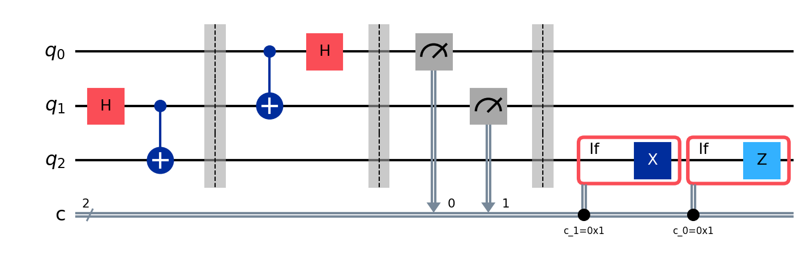

# 03: Quantum Teleportation

## What is Quantum Teleportation?

Quantum teleportation is a protocol that uses entanglement and classical communication to transfer the state of one qubit to another qubit at a distant location.

Important points to clarify first:

- No matter or energy is transported. What is transferred is the **quantum state (information)**
- It does not enable faster-than-light communication. **Classical communication (2 bits)** is required during the protocol, which is constrained by the speed of light
- The quantum state at the source is **destroyed**. This is consistent with the no-cloning theorem (see Note 01)

### Prerequisites

This note assumes knowledge of the following:

- Qubit state representation, measurement, entanglement, Bell states (Note 01)
- Pauli gates $X$, $Z$, Hadamard gate $H$, CNOT gate (Note 02)

---

## Protocol Setup

### Characters and Roles

- **Alice**: Has a quantum state $\vert\psi\rangle$ and wants to send it to Bob
- **Bob**: Wants to receive the quantum state from Alice

Alice and Bob are at physically separated locations.

### Resources Used

1. **Entangled qubit pair (Bell pair)**: Alice and Bob each hold one qubit
2. **Classical communication channel**: A means for Alice to send 2 bits of classical information to Bob
3. **Qubits**: 3 in total (Alice has 2, Bob has 1)

### Qubit Assignment

The three qubits are labeled $q_1, q_2, q_3$ (numbered from left following the convention of Note 01):

| Qubit | Owner | Role |
|-----------|--------|------|
| $q_1$ | Alice | Unknown quantum state $\vert\psi\rangle$ to be transferred |
| $q_2$ | Alice | Alice's side of the Bell pair |
| $q_3$ | Bob | Bob's side of the Bell pair |

---

## Protocol Steps

### Preparation of Initial State

Let the state to be transferred be a general single-qubit state:

$$
\vert\psi\rangle = \alpha\vert 0\rangle + \beta\vert 1\rangle
$$

Here $\alpha, \beta$ are complex numbers unknown even to Alice, satisfying $\lvert\alpha\rvert^2 + \lvert\beta\rvert^2 = 1$.

Alice and Bob share the Bell state $\vert\Phi^+\rangle = \frac{\vert 00\rangle + \vert 11\rangle}{\sqrt{2}}$ in advance ($q_2$ with Alice, $q_3$ with Bob).

The initial state of the three-qubit system is:

$$
\vert\Psi_0\rangle = \vert\psi\rangle_{q_1} \otimes \vert\Phi^+\rangle_{q_2 q_3}
$$

Expanding this:

$$
\vert\Psi_0\rangle = (\alpha\vert 0\rangle + \beta\vert 1\rangle) \otimes \frac{\vert 00\rangle + \vert 11\rangle}{\sqrt{2}}
$$

$$
= \frac{\alpha}{\sqrt{2}}(\vert 000\rangle + \vert 011\rangle) + \frac{\beta}{\sqrt{2}}(\vert 100\rangle + \vert 111\rangle)
$$

Here $\vert abc\rangle = \vert a\rangle_{q_1} \vert b\rangle_{q_2} \vert c\rangle_{q_3}$.

### Step 1: CNOT Gate

Alice applies the CNOT gate with $q_1$ (control) and $q_2$ (target).

The CNOT operation is $\vert a, b\rangle \to \vert a, a \oplus b\rangle$ (see Note 02). Since nothing is done to $q_3$, we apply $\text{CNOT}_{12} \otimes I_3$:

$$
\vert 000\rangle \overset{ \text{CNOT}_{12} }{\longrightarrow} \vert 000\rangle, \quad \vert 011\rangle \overset{ \text{CNOT}_{12} }{\longrightarrow} \vert 011\rangle
$$

$$
\vert 100\rangle \overset{ \text{CNOT}_{12} }{\longrightarrow} \vert 110\rangle, \quad \vert 111\rangle \overset{ \text{CNOT}_{12} }{\longrightarrow} \vert 101\rangle
$$

Therefore:

$$
\vert\Psi_1\rangle = \frac{\alpha}{\sqrt{2}}(\vert 000\rangle + \vert 011\rangle) + \frac{\beta}{\sqrt{2}}(\vert 110\rangle + \vert 101\rangle)
$$

### Step 2: Hadamard Gate

Alice applies the Hadamard gate $H$ to $q_1$. Since nothing is done to $q_2, q_3$, we apply $H_1 \otimes I_2 \otimes I_3$.

The action of $H$ is $\vert 0\rangle \to \frac{\vert 0\rangle + \vert 1\rangle}{\sqrt{2}}$ and $\vert 1\rangle \to \frac{\vert 0\rangle - \vert 1\rangle}{\sqrt{2}}$ (see Note 02).

Applying $H$ to each term:

$$
\vert 0\rangle \vert 00\rangle \overset{ H_1 }{\longrightarrow} \frac{\vert 0\rangle + \vert 1\rangle}{\sqrt{2}} \vert 00\rangle, \quad \vert 0\rangle \vert 11\rangle \overset{ H_1 }{\longrightarrow} \frac{\vert 0\rangle + \vert 1\rangle}{\sqrt{2}} \vert 11\rangle
$$

$$
\vert 1\rangle \vert 10\rangle \overset{ H_1 }{\longrightarrow} \frac{\vert 0\rangle - \vert 1\rangle}{\sqrt{2}} \vert 10\rangle, \quad \vert 1\rangle \vert 01\rangle \overset{ H_1 }{\longrightarrow} \frac{\vert 0\rangle - \vert 1\rangle}{\sqrt{2}} \vert 01\rangle
$$

Substituting and simplifying:

$$
\vert\Psi_2\rangle = \frac{\alpha}{2}(\vert 0\rangle + \vert 1\rangle)(\vert 00\rangle + \vert 11\rangle) + \frac{\beta}{2}(\vert 0\rangle - \vert 1\rangle)(\vert 10\rangle + \vert 01\rangle)
$$

Expanding:

$$
\vert\Psi_2\rangle = \frac{1}{2}\Big[\vert 00\rangle(\alpha\vert 0\rangle + \beta\vert 1\rangle) + \vert 01\rangle(\alpha\vert 1\rangle + \beta\vert 0\rangle) + \vert 10\rangle(\alpha\vert 0\rangle - \beta\vert 1\rangle) + \vert 11\rangle(\alpha\vert 1\rangle - \beta\vert 0\rangle)\Big]
$$

Here the left two qubits are $q_1 q_2$ (Alice's side) and the right single qubit is $q_3$ (Bob's side).

---

## Derivation of the Expansion (Details)

The above simplification is the core of quantum teleportation, so we show it without omissions.

We group the expansion of $\vert\Psi_2\rangle$ by the state of $q_1 q_2$. First, we write out all 8 terms:

$$
\vert\Psi_2\rangle = \frac{\alpha}{2}\vert 000\rangle + \frac{\alpha}{2}\vert 011\rangle + \frac{\alpha}{2}\vert 100\rangle + \frac{\alpha}{2}\vert 111\rangle + \frac{\beta}{2}\vert 010\rangle + \frac{\beta}{2}\vert 001\rangle - \frac{\beta}{2}\vert 110\rangle - \frac{\beta}{2}\vert 101\rangle
$$

Classifying by the value of $q_1 q_2$:

**Terms with $q_1 q_2 = 00$:**

$$
\frac{\alpha}{2}\vert 000\rangle + \frac{\beta}{2}\vert 001\rangle = \frac{1}{2}\vert 00\rangle \otimes (\alpha\vert 0\rangle + \beta\vert 1\rangle)
$$

**Terms with $q_1 q_2 = 01$:**

$$
\frac{\alpha}{2}\vert 011\rangle + \frac{\beta}{2}\vert 010\rangle = \frac{1}{2}\vert 01\rangle \otimes (\beta\vert 0\rangle + \alpha\vert 1\rangle)
$$

**Terms with $q_1 q_2 = 10$:**

$$
\frac{\alpha}{2}\vert 100\rangle - \frac{\beta}{2}\vert 101\rangle = \frac{1}{2}\vert 10\rangle \otimes (\alpha\vert 0\rangle - \beta\vert 1\rangle)
$$

**Terms with $q_1 q_2 = 11$:**

$$
\frac{\alpha}{2}\vert 111\rangle - \frac{\beta}{2}\vert 110\rangle = \frac{1}{2}\vert 11\rangle \otimes (-\beta\vert 0\rangle + \alpha\vert 1\rangle)
$$

Summarizing:

$$
\vert\Psi_2\rangle = \frac{1}{2}\Big[\vert 00\rangle(\alpha\vert 0\rangle + \beta\vert 1\rangle) + \vert 01\rangle(\beta\vert 0\rangle + \alpha\vert 1\rangle) + \vert 10\rangle(\alpha\vert 0\rangle - \beta\vert 1\rangle) + \vert 11\rangle(-\beta\vert 0\rangle + \alpha\vert 1\rangle)\Big]
$$

---

## Step 3: Alice's Measurement

Alice measures $q_1$ and $q_2$ in the computational basis. Four outcomes are obtained with equal probability $1/4$.

Depending on the measurement result, Bob's $q_3$ state becomes:

| Alice's measurement result ($q_1 q_2$) | Bob's $q_3$ state | Relation to $\vert\psi\rangle$ |
|---|---|---|
| $\vert 00\rangle$ | $\alpha\vert 0\rangle + \beta\vert 1\rangle$ | $\vert\psi\rangle$ itself |
| $\vert 01\rangle$ | $\beta\vert 0\rangle + \alpha\vert 1\rangle$ | $X\vert\psi\rangle$ |
| $\vert 10\rangle$ | $\alpha\vert 0\rangle - \beta\vert 1\rangle$ | $Z\vert\psi\rangle$ |
| $\vert 11\rangle$ | $-\beta\vert 0\rangle + \alpha\vert 1\rangle$ | $ZX\vert\psi\rangle$ (up to global phase) |

Here $X$ (bit flip) and $Z$ (phase flip) are Pauli gates (see Note 02):

$$
X = \begin{pmatrix} 0 & 1 \\\\ 1 & 0 \end{pmatrix}, \quad Z = \begin{pmatrix} 1 & 0 \\\\ 0 & -1 \end{pmatrix}
$$

### Verification of the Relations

Checking the $\vert 01\rangle$ case:

$$
X\vert\psi\rangle = X(\alpha\vert 0\rangle + \beta\vert 1\rangle) = \alpha\vert 1\rangle + \beta\vert 0\rangle = \beta\vert 0\rangle + \alpha\vert 1\rangle \quad \checkmark
$$

The $\vert 10\rangle$ case:

$$
Z\vert\psi\rangle = Z(\alpha\vert 0\rangle + \beta\vert 1\rangle) = \alpha\vert 0\rangle - \beta\vert 1\rangle \quad \checkmark
$$

The $\vert 11\rangle$ case ($ZX = -XZ$, so identical up to global phase $-1$):

$$
ZX\vert\psi\rangle = Z(\beta\vert 0\rangle + \alpha\vert 1\rangle) = \beta\vert 0\rangle - \alpha\vert 1\rangle = -(\alpha\vert 1\rangle - \beta\vert 0\rangle) = -(-\beta\vert 0\rangle + \alpha\vert 1\rangle)
$$

The global phase $-1$ does not affect observations, so Bob's state is equivalent to $-\beta\vert 0\rangle + \alpha\vert 1\rangle$. $\checkmark$

---

## Step 4: Classical Communication and Correction

Alice sends the measurement result (2 bits of classical information) to Bob through a classical communication channel.

Bob applies a correction gate to $q_3$ based on the received information:

| Alice's measurement result | Bob's correction | State after correction |
|---|---|---|
| $00$ | Do nothing ($I$) | $\alpha\vert 0\rangle + \beta\vert 1\rangle = \vert\psi\rangle$ |
| $01$ | Apply $X$ | $X(\beta\vert 0\rangle + \alpha\vert 1\rangle) = \alpha\vert 0\rangle + \beta\vert 1\rangle = \vert\psi\rangle$ |
| $10$ | Apply $Z$ | $Z(\alpha\vert 0\rangle - \beta\vert 1\rangle) = \alpha\vert 0\rangle + \beta\vert 1\rangle = \vert\psi\rangle$ |
| $11$ | Apply $ZX$ | $ZX(-\beta\vert 0\rangle + \alpha\vert 1\rangle) = \alpha\vert 0\rangle + \beta\vert 1\rangle = \vert\psi\rangle$ |

### Verification of the $\vert 01\rangle$ Case Correction

Bob's state is $\beta\vert 0\rangle + \alpha\vert 1\rangle$. Applying $X$:

$$
X(\beta\vert 0\rangle + \alpha\vert 1\rangle) = \beta\vert 1\rangle + \alpha\vert 0\rangle = \alpha\vert 0\rangle + \beta\vert 1\rangle = \vert\psi\rangle
$$

### Verification of the $\vert 11\rangle$ Case Correction

Bob's state is $-\beta\vert 0\rangle + \alpha\vert 1\rangle$. First apply $X$, then $Z$:

$$
X(-\beta\vert 0\rangle + \alpha\vert 1\rangle) = -\beta\vert 1\rangle + \alpha\vert 0\rangle = \alpha\vert 0\rangle - \beta\vert 1\rangle
$$

$$
Z(\alpha\vert 0\rangle - \beta\vert 1\rangle) = \alpha\vert 0\rangle + \beta\vert 1\rangle = \vert\psi\rangle
$$

Regardless of the measurement result, Bob obtains $\vert\psi\rangle$ after correction.

---

## Concrete Example

We trace the teleportation of $\vert\psi\rangle = \vert +\rangle = \frac{\vert 0\rangle + \vert 1\rangle}{\sqrt{2}}$. Here $\alpha = \beta = \frac{1}{\sqrt{2}}$.

### Initial State (After Bell Pair Preparation)

After applying $H$ to $q_2$ and $\text{CNOT}_{23}$ to generate the Bell pair:

$$
\vert\Psi_0\rangle = \frac{1}{\sqrt{2}}(\vert 0\rangle + \vert 1\rangle) \otimes \frac{1}{\sqrt{2}}(\vert 00\rangle + \vert 11\rangle) = \frac{1}{2}(\vert 000\rangle + \vert 011\rangle + \vert 100\rangle + \vert 111\rangle)
$$

### After $\text{CNOT}_{12}$

$$
\vert\Psi_1\rangle = \frac{1}{2}(\vert 000\rangle + \vert 011\rangle + \vert 110\rangle + \vert 101\rangle)
$$

### After Hadamard

$$
\vert\Psi_2\rangle = \frac{1}{2\sqrt{2}}\Big[(\vert 0\rangle + \vert 1\rangle)\vert 00\rangle + (\vert 0\rangle + \vert 1\rangle)\vert 11\rangle + (\vert 0\rangle - \vert 1\rangle)\vert 10\rangle + (\vert 0\rangle - \vert 1\rangle)\vert 01\rangle\Big]
$$

Grouping by $q_1 q_2$:

$$
\vert\Psi_2\rangle = \frac{1}{2}\Big[\vert 00\rangle \cdot \frac{\vert 0\rangle + \vert 1\rangle}{\sqrt{2}} + \vert 01\rangle \cdot \frac{\vert 0\rangle + \vert 1\rangle}{\sqrt{2}} + \vert 10\rangle \cdot \frac{\vert 0\rangle - \vert 1\rangle}{\sqrt{2}} + \vert 11\rangle \cdot \frac{-\vert 0\rangle + \vert 1\rangle}{\sqrt{2}}\Big]
$$

Here $\frac{\vert 0\rangle + \vert 1\rangle}{\sqrt{2}} = \vert +\rangle$ and $\frac{\vert 0\rangle - \vert 1\rangle}{\sqrt{2}} = \vert -\rangle$.

| Alice's measurement result | Bob's state | Correction | After correction |
|---|---|---|---|
| $00$ | $\vert +\rangle$ | $I$ | $\vert +\rangle$ |
| $01$ | $\vert +\rangle$ | $X$ | $X\vert +\rangle = \vert +\rangle$ |
| $10$ | $\vert -\rangle$ | $Z$ | $Z\vert -\rangle = \vert +\rangle$ |
| $11$ | $\frac{-\vert 0\rangle + \vert 1\rangle}{\sqrt{2}}$ | $ZX$ | $\vert +\rangle$ |

For the $\vert 01\rangle$ case, $X\vert +\rangle = X \frac{\vert 0\rangle + \vert 1\rangle}{\sqrt{2}} = \frac{\vert 1\rangle + \vert 0\rangle}{\sqrt{2}} = \vert +\rangle$. $X$ flips the bits, but since $\vert +\rangle$ is an equal superposition of $\vert 0\rangle$ and $\vert 1\rangle$, it remains unchanged after flipping.

For the $\vert 10\rangle$ case, $Z\vert -\rangle = Z \frac{\vert 0\rangle - \vert 1\rangle}{\sqrt{2}} = \frac{\vert 0\rangle + \vert 1\rangle}{\sqrt{2}} = \vert +\rangle$. $Z$ flips the sign of $\vert 1\rangle$, so the $-$ sign becomes $+$.

In all cases, Bob obtains $\vert +\rangle$.

---

## Circuit Representation of the Protocol

The quantum teleportation circuit is shown below. Time flows from left to right:

> **Note:** In the text, qubits are described as $q_1, q_2, q_3$ (1-indexed), but in the circuit diagram they are displayed as $q_0, q_1, q_2$ (0-indexed). Note that the indices are shifted by one. The correspondence is $q_1 \to q_0$, $q_2 \to q_1$, $q_3 \to q_2$.

The circuit consists of three phases:

**Preparation phase (front part of the diagram, omitted):** Generate the Bell pair on $q_2$ and $q_3$ ($H$ + CNOT).

**Alice's operations:** CNOT on $q_1$ and $q_2$, $H$ on $q_1$, then measure $q_1$ and $q_2$.

**Bob's correction:** Apply $X^{m_2}$ based on the measurement result $m_2$ (measurement result of $q_2$), and $Z^{m_1}$ based on $m_1$ (measurement result of $q_1$) to $q_3$. The double line ($=$) represents classical bit transmission.

---

## Bell Pair Generation

The Bell state $\vert\Phi^+\rangle = \frac{\vert 00\rangle + \vert 11\rangle}{\sqrt{2}}$ is obtained by applying a Hadamard gate to $q_2$ to create a superposition and then generating entanglement with $\text{CNOT}_{23}$ (see Notes 01, 02).

---

## Consistency with the No-Cloning Theorem

Quantum teleportation might appear to "copy" a quantum state, but it does not.

The **No-Cloning Theorem** states that no operation can duplicate an arbitrary unknown quantum state (see Note 01).

In teleportation, Alice's $q_1$ state is **destroyed** by the measurement in Step 3. After measurement, $q_1$ is projected onto either $\vert 0\rangle$ or $\vert 1\rangle$, and the original $\vert\psi\rangle = \alpha\vert 0\rangle + \beta\vert 1\rangle$ no longer exists on Alice's side.

In other words, teleportation is not a "copy" but a "transfer" of the quantum state. The state disappears from one side and appears on the other. This is fully consistent with the no-cloning theorem.

---

## Necessity of Classical Communication

At the point when Alice's measurement is complete, Bob's $q_3$ is in one of four possible states. However, Bob does not know which state it is. Without receiving the measurement result via classical communication, he cannot know which correction gate to apply and cannot recover the original state.

This means that quantum teleportation cannot be used for faster-than-light communication. Information transmission from Alice to Bob is constrained by the speed of the classical communication channel.

---

## Summary

| Concept | Content |
|------|------|
| What is transferred | Quantum state (not matter) |
| Required resources | 1 Bell pair + 2 bits of classical communication |
| Gates used | CNOT, $H$, $X$, $Z$ |
| Number of qubits | 3 (Alice: $q_1, q_2$; Bob: $q_3$) |
| Number of measurements | 2 ($q_1$ and $q_2$ measured in computational basis) |
| Correction operation | $Z^{m_1} X^{m_2}$ depending on measurement result $m_1 m_2$ |
| No-cloning theorem | No contradiction (original state is destroyed by measurement) |
| Faster-than-light communication | Impossible (classical communication is essential) |
